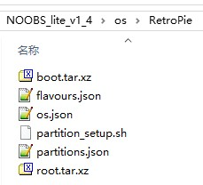
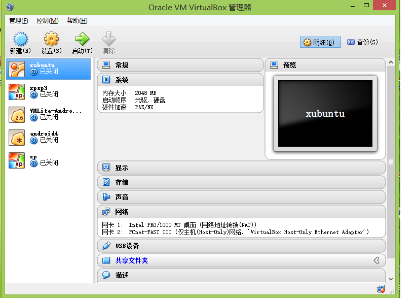
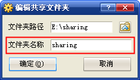
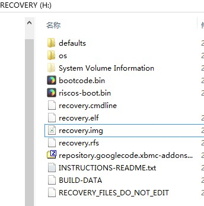

## 简介

前段时间折腾了一下树莓派，树莓派的操作系统安装时需要自己烧录img文件到SD卡中。烧录SD卡大体分为两种方式一种是吧一个img文件烧录到整张卡中，另一种是通过NBOOBS将多个img文件烧录到一张卡中。前者在windows下通过Win32DiskImager这个软件就能轻松的做到，后者需要使用到NBOOBS，下载地址：http://downloads.raspberrypi.org/NOOBS_latest 。

NOOBS提供多个操作系统共存的方案，他提供了一个图形化的安装界面，在安装过程中读取定义好的配置文件，来选择要安装的各个系统。通过上文提到的下载地址下载回来的NOOBS，里面只预置了Raspbian这个系统，但是我们想安装一些自定义的系统改怎么办呢？这就是本文要解决的问题。

## 实现

关于添加自定义操作系统的问题，在NOOBS的github文档上也是有说明的，详见[这里](https://github.com/raspberrypi/noobs#how-to-create-a-custom-os-version)。假设我们现在要安装[RetroPie](http://blog.petrockblock.com/retropie/)这个系统，我们首先从[官方地址](http://blog.petrockblock.com/download/retropie-project-image/)上把它下载下来。根据github上提到的教程，那么制作NOOBS系统就应该是下面几步。

1. 下载NOOBS.
2. 解压下载后的文件。
3. 进入`os`文件夹。
4. 选择其中的一个子文件，拷贝一份新的。这里就拿Raspbin这个文件夹开刀。拷贝完成后，将文件夹改名RetroPie，现在目录下的文件结构如下：

  
下面要依次讲解各个文件的作用。
5. 好，现在我们修改RetroPie文件夹下的os.json文件，这里面定义的数据将会在安装的时候显示为操作系统的标题和描述等信息。我大体上将其改为如下形式：

        {
          "name": "retropie",
          "version": "2.3",
          "release_date": "2014-05-31",
          "kernel": "3.12",
          "description": "The RetroPie Project started with the idea of turning the Raspberry Pi into a retro-gaming console and evolved ever since.",
          "url": "http://blog.petrockblock.com/retropie/",
          "username": "pi",
          "password": "raspberry",
          "feature_level": 123900
        }
    **配置文件2.1 os.json**

其中`name`肯定就是名称了，然后是`version`版本，`description`描述等信息。   
同时，我们留意到文件`flavours.json`中的内容和`os`中很多重复，可以称作是`os.json`的简版，这个文件最终要被引导程序读取，显示引导菜单，供给用户选择安装哪些操作系统。注意由于我们的文件夹是复制产生的，所以这个文件也要相应的修改，否则引导菜单发现了两个一模一样的操作系统名称，就会忽略掉其中一个，这样你辛辛苦苦做出来的引导就不管用了。  
6. 【可选】你可以放一个RetroPie.png来定义一下当前操作系统的logo。  
7. 【可选】你可以在文件夹`slides_vga`中放一下说明性的图片，他会在安装过程中当成幻灯片播放出来。  
8. 这一步是进行分区文件配置，先把做好的分区文件`partitions.json`贴出来：

    {
      "partitions": [
        {
          "label": "boot",
          "filesystem_type": "FAT",
          "partition_size_nominal": 60,
          "want_maximised": false,
          "uncompressed_tarball_size": 11,
          "mkfs_options": "-F 32"
        },
        {
          "label": "root",
          "filesystem_type": "ext4",
          "partition_size_nominal": 2700,
          "want_maximised": true,
          "mkfs_options": "-O ^huge_file",
          "uncompressed_tarball_size": 2203
        }
      ]
    }

**配置文件2.2 partitions.json**

可以看到在json文件中属性partitions是一个数组类型，数组每个元素定义的是一个分区信息。首先看label为boot的分区，这是一个FAT格式的分区，被用作操作系统启动分区；然后label为root的是ext4分区，里面存放linux操作系统分区。partition_size_nominal是说分区的大小，want_maximised是说当前分区是否需要被扩展，如果为false，则分区的大小就是partition_size_nominal的指定值，如果为true，则noobs会根据sd卡的大小尽量的分配尽可能多的空间给当前分区。   
9. 之前说过，我们从retropie官网上下载下来它的安装文件，将其解压后我们得到一个img文件。按照noobs给出的文档，根据partitions.json中的配置的信息，我们应该生成两个压缩文件，分别为boot.tar.xz和root.tar.gz，文件名实际上对应的是配置文件中的label属性。那么我们现在得到的是img文件，怎样得到这两个文件呢？  
    如果你是用linux，这个问题很好解决，linux下可以使用mount命令直接把img文件挂载到指定目录上；如果使用windows，那就只能用虚拟机了。好吧，我就是用的windows，打开自己的虚拟机，通过vbox上的共享目录，来访问windows上的这个img文件。  
       
    **图2.1 共享文件夹设置1**  
    在弹出的界面中新增一个共享设置，我们假设img文件放在e:\sharing下，那么可以做如下设置：  
      
    **图2.2 新建共享**  
    最后在ubuntu下通过命令`mount -t vboxsf sharing /mnt/share`来加载这个共享（这里假设/mnt/share目录已经存在了）。在/mnt/share下我们用fdisk命令来查看img文件内部的分区情况：

    fdisk -lu RetroPieImage_ver2.3.img
    该命令将会输出如下内容：
    
    Disk RetroPieImage_ver2.3.img: 3460 MB, 3460300800 bytes
    255 heads, 63 sectors/track, 420 cylinders, total 6758400 sectors
    Units = 扇区 of 1 * 512 = 512 bytes
    Sector size (logical/physical): 512 bytes / 512 bytes
    I/O size (minimum/optimal): 512 bytes / 512 bytes
    Disk identifier: 0x000981cb
    
                       设备 启动 起点 终点 块数 Id 系统
    RetroPieImage_ver2.3.img1 8192 122879 57344 c W95 FAT32 (LBA)
    RetroPieImage_ver2.3.img2 122880 6676479 3276800 83 Linux

通过输出可以轻易的发现，img文件中有两个分区，第一个分区从8192扇区开始，第二个分区从122880扇区开始，然后输出信息还指示一个扇区是512字节。接下来我们创建两个目录来加载这两个目录：

    sudo mkdir /mnt/share/img1
    sudo mkdir /mnt/share/img2

接下来是mount命令的使用，mount命令的`-o`参数可以指定从某一个字节处开始mount，那么加载第一个分区的命令就是如下所示了：

    sudo mount -o loop,offset=$((8192*512)) RetroPieImage_ver2.3.img /mnt/share/img1

现在我们进入img1目录，进行打包：

    tar -cvpf ../boot.tar .

其中打包的时候我们制定了`p`参数，这里是告诉tar命令，在tar命令运行时，要保留原文件的权限属性不变。  
接着就是使用xz命令就行压缩了：

    xz -9 -e boot.tar

最终生成一个`boot.tar.xz`文件，拷贝到文件夹RetroPie中。同理我们可以再生成一个`root.tar.xz`文件。**但是要注意，在生成`boot.tar`的时候要使用管理员权限，即运行`sudo tar -cvpf ../root.tar`，否某些文件会提示没有权限操作。**  
10. noobs在进行分区的时候需要读取脚本`partition_setup.sh`来完成分区操作，如果当前系统是由`Raspbian`改装来的（比如`RetroPie`和`raspbmc`、`Pidora`），那么直接使用`Raspbian`文件夹中的`partition_setup.sh`即可，但是有一些系统不是标准linux，比如说`openelec`，这时候你可以从github项目[procount/noobsconfig](https://github.com/procount/noobsconfig "")找到相应的sh脚本文件。  
11. 最后我们就是格式化SD卡了，使用SDFormatter（[下载页面地址](https://www.sdcard.org/chs/downloads/formatter_4/)）将你的SD卡格式化，然后将制作好的noobs文件全部拷贝到sd卡中，保证recovery.img在sd卡根目录：

  
**图2.3 sd卡根目录**  
至此一个自定义的操作系统已经成功制作完成，将sd卡插入树莓派就可以安装了。
