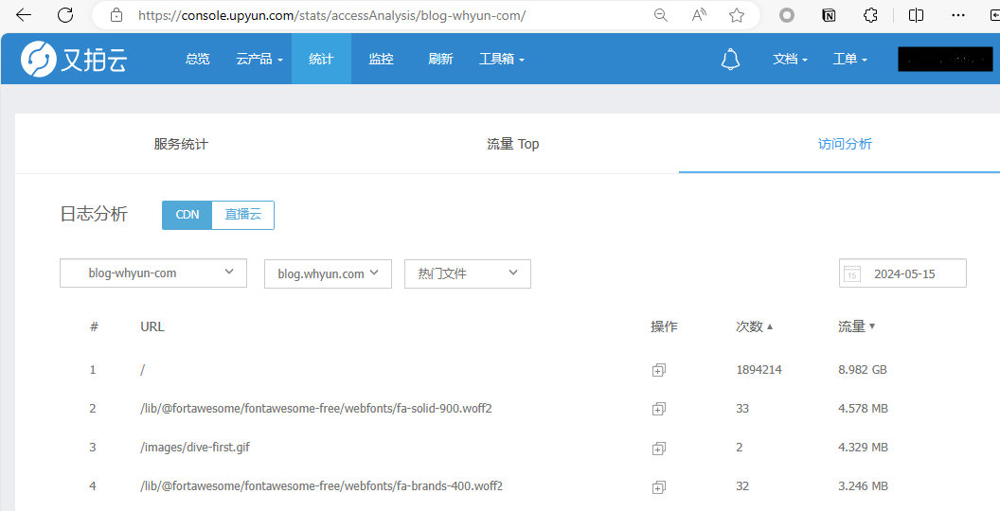
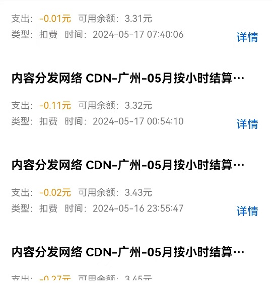
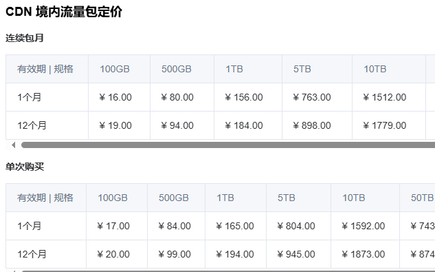
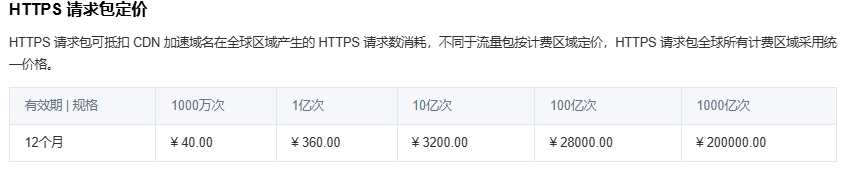
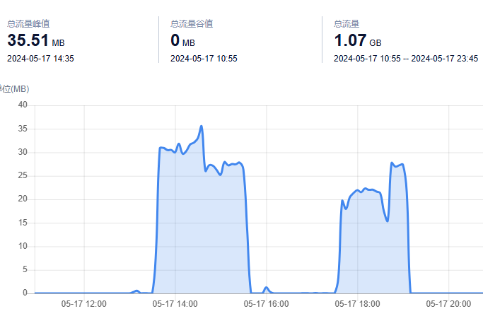
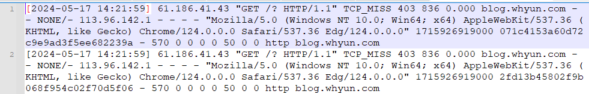
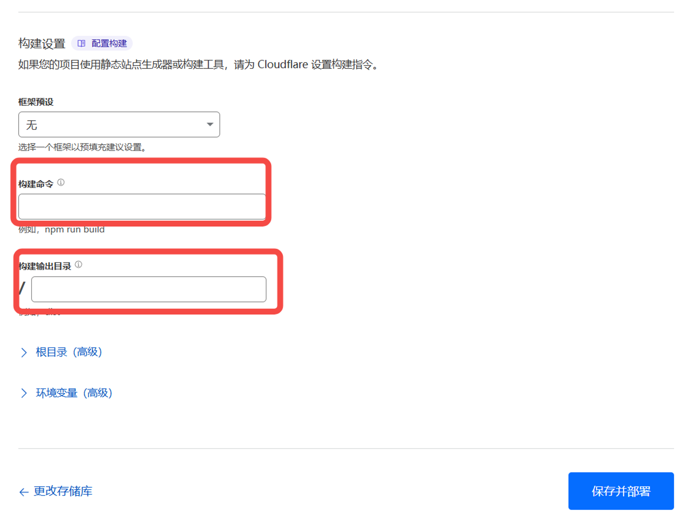
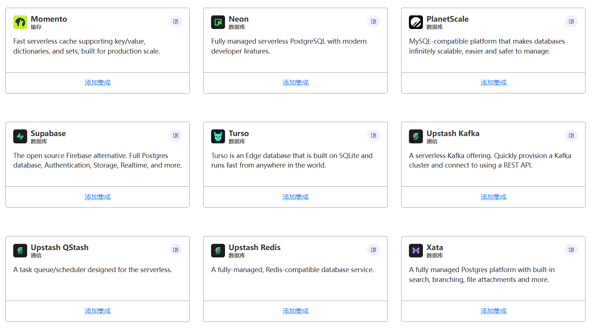
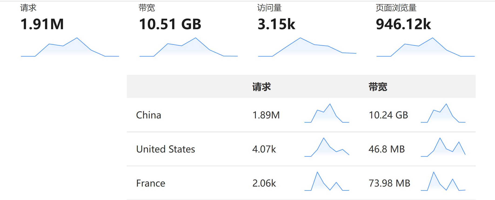

笔者有写博客的习惯，借助于github强大page功能和自己娴熟的markdown技巧，可以快速实现本地编写，网上预览的效果。不过使用github page功能多少有些小瑕疵，就是大陆的用户可能根本打不开网站。当时查了一下资料，发现使用cdn做代理，可以完美解决这个问题，加之当时资料的博主推荐的是又拍云，我也紧跟着入坑了。

一直用这个产品，其实体验还挺不错的，商家当时免费送了50GB流量，而我的博客访问量少的可怜，50GB几乎就是天文数字了。期间发现虽然流量免费，但是回源的时候需要收费，所以我又充了几块钱，这么多年了，就一直用着。

## 滔天的攻击，又拍云接不住了！

直到有一天，我突然收到了一条又拍云的报警短信，说是我购买的cdn服务 https 请求数过多。我当时多少有些诧异，心想估计是某个爬虫误伤了我的网站，加之当时工作比较忙，就没来得及顾上。等待下班回家，我迫不及待的打开电脑，进去又拍云管理后台，定睛一看，直接被惊呆了，一天竟然有一百多万次请求，肯定是被攻击了。我下载日志顺便看了一下，攻击发出者是一组固定的ip。



## 及时止损，靠腾讯云？

看来只能切换cdn厂商了 找一个不按照 https 进行收费的厂商，我找了一圈还真没有，大家都是几毛钱一万次，不过我发现腾讯云每月送了300万次https请求。好吧我认为攻击者应该很快就会意识到，我跟他无冤无仇，他应该是找错人了。

> 整个腾讯云 CDN 配置过程还是挺不友好的，https 证书需要在单独的管理后台中做申请，然后再跟 CDN 产品实例做关联。证书的失效时间为三个月，默认情况下失效后，需要手动重新生成。不过他还提供了证书托管功能，由腾讯云自动触发证书续期，我心想这不是故意折腾用户吗，明明有解决方案，非要让用户多走两步。
> 

换完腾讯云后，我用了一天，然后突然在微信上收到了腾讯云的账单提醒，看上去单笔订单价格都不高，



但是他竟然是按照小时进行收费的，虽然大部分时间一小时1分钱，但是只要攻击过来，就是几毛钱，每天被收一块钱很正常。

> 腾讯云按小时收费的计算方法，参见官方文档 [内容分发网络 CDN 基础服务计费-购买指南-文档中心-腾讯云 (tencent.com)](https://cloud.tencent.com/document/product/228/75562#.E8.AE.A1.E8.B4.B9.E6.96.B9.E5.BC.8F-.E6.B5.81.E9.87.8F.E5.B0.8F.E6.97.B6.E7.BB.93)
> 

我心想要不我买个流量包吧，说不定流量包更优惠呢，我查了一下[官方文档](https://cloud.tencent.com/document/product/228/60462)



100GB 接近 20 十块钱，而且就目前这个攻击法，也就撑十天。还没完，文档再往下翻，还有一个 https 请求次数收费表格：



合着这和流量包还是分开请求的。 

## 试试ucloud吧，也许管用呢

看来腾讯云是不能用了，早晚会掏空我的腰包，于是我又研究了他的竞争对手阿里云，得到的答案，阿里云跟腾讯云是一个套路，默认按小时收费，https 请求数单独收费。

看来这两者是都不能用了，后来我突然想到了我之前在 ucloud 上购买过服务器，比阿里和腾讯便宜，那么他的 CDN 业务是不是也便宜呢。抱着试试看的态度，我开通了 ucloud 的 CDN 业务，还别说他们的 CDN 流量包使用时没有时间限制，不像腾讯和阿里每小时都来薅我一次羊毛。

为了少走弯路，我特意还咨询了 ucloud 的售前支持，得到的回复是对于静态网站的 CDN 是没有 https 请求次数收费的。同时 ucloud 还提供了 IP 黑名单的功能，这样我就可以通过录入屏蔽攻击者 IP 的方式来屏蔽请求了。各大云厂商，包括腾讯云也提供了 IP 黑名单的功能，但是最终 HTTP 请求还是会到达 CDN 服务器，只不过服务器返回一个错误的状态码而已。一开始我跟收钱支持人员沟通的时候以为 ucloud 中配置了 IP 黑名单后，不会有 HTTP 请求产生，后来发现我是对他的说法理解有误。

配置完了之后，我当天观察了一下，发现依然有比较大的攻击流量产生：



下载了一下日志，发现攻击者的 IP 依然在列



只不过 ucloud 将其状态码置为 403 了。

## 柳暗花明，网友的力量是伟大的！

其实在攻击被发现时，我就把状况发到了社交平台中，除去插科打诨，自曝家门的网友外，还真有网友提到了 cloudflare page，说是可以薅羊毛。看到这个关键字，我就兴奋起来了，一定要一探究竟。

我查看了 cloudflare 的官方文档，不看不知道，一看吓一跳，人家托管静态资源是全免费的！你听的没错，是全免费，什么流量费、https请求数，全都上不封顶！太残暴了吧？

说时迟那时快，我赶紧利用下班时间把网站资源便宜到 cloudflare上。登陆控制台，找到worker & page 菜单，新建一个 page 项目，然后关联一下github项目仓库，设置一下构建命令和生成静态资源目录，一个 page 站点就这么生成了。



如果你想使用自己的域名访问这个 page站点，也超级简单，直接在dns后台配置一个 cname， 将你的域名指向官方生成的page域名即可。顺便说一下，cname生效后，自动开启 https 支持，无需手动绑定证书，比国内一众厂商省心多了。

### Github上的子站点怎么办？

由于我的github page不仅仅在一个站点上启用了。默认的 [yunnysunny.github.io](https://yunnysunny.github.io)肯定是挂在/上的，但是我还有一个 nodebook项目，按理来说未迁移到 cloudflare 之前是挂在到 /nodebook 下的，迁移完之后，构建生成的静态文件只有默认项目的，所以如果不做处理请求 /nodebook 会直接 404。不过作为一个成熟的产品， cloudflare page已经考虑到了重定向的问题。我把 nodebook 项目也托管在 cloudflare 上，然后在 yunnysunny.github.io 构建时生成一个名字为 _redircets 的文件，并添加如下内容：

```
/nodebook/* https://node.whyun.com/:splat 
```

其中 [node.whyun.com](https://node.whyun.com) 是 nodebook 项目现在托管的域名。现在访问https://blog.whyun.com/nodebook/xxx 会302 跳转到 https://node.whyun.com/xxx 。

### 其他特性

cloudflare 是支持 IPv6 + HTTP 3.0 的，助力你的网站飞起来。

cloudflare page 是一个全栈产品，可以通过编写其内置的 [Function](https://developers.cloudflare.com/pages/functions/) ，它是一种无服务应用，类似于 aws lambda 产品。并且其提供的免费配额也很诱人，每天 10 万次请求，每分钟一千次请求，对于个人网站或者小企业来说完全够用。并且其还提供了集成各种第三方免费数据库的功能：



让你的开发没有后顾之忧。

准备再写一篇关于 Function 的使用文章，所以欲知后事如何，窃听下回分解了。

## 成果

最后放一张 cloudflare 最近 7 天承载的流量统计报表：

