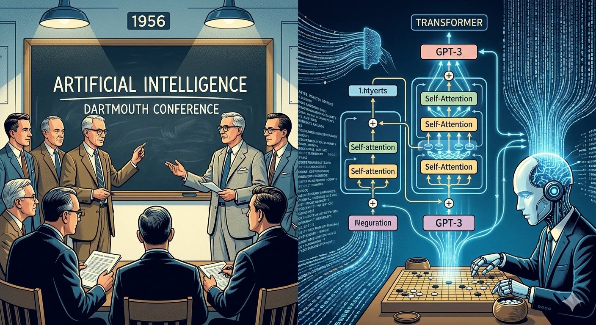
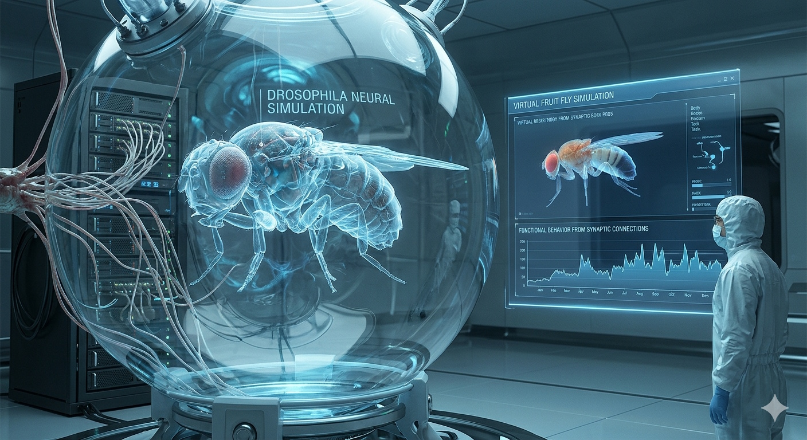
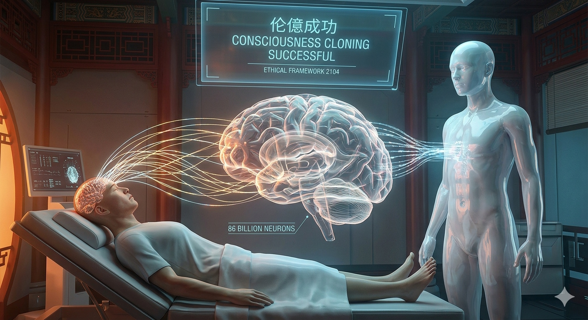

## 编者按
中国俗话说，三十年河东，三十年河西，三十年代表一个中青年的成长期，三十年代表一辈人的产出高峰期。下面我在介绍历史的时候，也会以三十年为一个周期来介绍。

我的标题写的是 中国 人工智能 编年史，然而中国的计算机技术起步较晚，人工智能的起步并不在中国，而是西方。虽然我们起步晚，但是中国在改革开放后，培养了一批又一批高质量的技术人才，这在国际上是无法替代的优势；虽然我们的国家遭受了西方社会的重重打压，硬件基础设施尚不完善，但是我们知耻而后勇，放弃了依赖国际技术的幻想，独立更生，短期内有差距，长期来看，人工智能的未来在中国。

## 人工智能史-西方篇
1956年：达特茅斯会议召开，麦卡锡等人首次提出“人工智能（AI）”一词。这次会议被公认为AI学科的正式起源,算是人工智能的萌芽。

1986年：反向传播（BP）算法被重新发明并推广,这一算法极大地推动了神经网络的训练，至今仍是深度学习的基石,机器学习开始与统计学深度融合，算法更加严谨。人工智能开始进入实际应用阶段。1998年：杨立昆（Yann LeCun）等人提出了卷积神经网络（CNN）的现代雏形（LeNet-5），奠定了AI处理图像的基础。

2006年：杰弗里·辛顿正式提出“深度学习（Deep Learning）”概念，标志着神经网络研究进入新纪元。2016年：DeepMind开发的AlphaGo以4:1的比分战胜围棋世界冠军李世石。围棋的复杂程度远超国际象棋，这标志着AI的推理和策略能力实现了质的飞跃。2017年：Google团队发表论文《Attention is All You Need》，提出了Transformer架构。这一架构取代了传统的RNN，成为当今所有大语言模型的基石。2020年：OpenAI发布拥有1750亿参数的GPT-3模型，展现了强大的少样本学习和文本生成能力，拉开了大模型时代的序幕。

2022年：ChatGPT上线，凭借极其流畅和智能的对话体验，在短时间内席卷全球，成为历史上增长最快的消费级应用之一。

## 人工智能史-中国篇
1987年：清华大学出版的《人工智能及其应用》成为国内首部自主知识产权的人工智能专著。时任国务委员宋健亲笔致信作者，称这是“中国科学界的一件大事”，标志着中国人工智能研究正式起步。

进入21世纪，随着国家科研投入的持续增加，以及一批具有国际视野的企业和人才的涌现，中国AI开始从学术走向产业，全面积蓄力量。如今被称为“AI四小龙”的商汤科技、旷视科技、依图科技、云从科技，均在此阶段后期（2011-2015年左右）相继成立，它们以计算机视觉技术为核心，开启了AI在中国的第一波创业浪潮。

2023年至2024年，中国涌现出数百个大模型，以智谱、月之暗面、百川智能等为代表的“大模型五虎”（或称“六小虎”）成为资本市场和行业关注的焦点。

## 人工智能史-假象篇

现在大家讨论人工智能时，都是聚焦在大模式上，大模型通过算法+算力支持，在各个领域提升了人类的脑力，但它不是人工智能的终极答案。大模型用数学模型来虚拟思考的，它并不是像生命一样利用神经元来进行思考。未来的人工智能一定是通过仿真神经系统来进行思考的，前些天的果蝇实验算是这个领域的开端，该实验虽然只是一个模拟实验，但是证明了仅凭突触级连接和神经递质类型信息，一个来自生物连接组的仿真大脑就能在具身环境中产生功能性行为。换句话说，不用数学算法，完全通过生物仿真，也能产生“脑回路”。虽然果蝇大脑有十二万五千个神经元，人类大脑有八百六十亿个，虽然实验的效果还略显粗糙。但果蝇实验给人造智能又迈出来的结实的一步。

中国在此领域也是有研究的，在 2024 年，整合了秀丽隐杆线虫的302个神经元连接组与虚拟躯体模型，首次实现了神经活动、身体运动与环境交互的闭环仿真，从当时的实验指标看，和美国的果蝇实验有一定的差距。但是我这么这篇文章的重点是对于未来做畅想。所以我不妨大胆的畅想一下，在 2054 年，中国的仿生神经研究应该会取得一定的突破，能够局部的仿真人类大脑的部分区域，并且通过内置微型仿生神经元的方式，来替代受损的脑组织。这不仅是医学的胜利，更是人工智能的终极形态——**“人机协同进化”**的开端。但这给人类带来了新的问题，接入大脑的放生神经元和人类大脑的融合过程中，可能会改变人的思维方式或者说性格。人类在此阶段尚不能完全掌控这种技术，只有少数的人在有生命健康危险的时候，才会选择移植人造神经元。

2084年，研究人员的研究范围从大脑神经元延申到了人体神经元，比如说脊神经，肌肉神经，甚至是皮肤神经，都进行了仿生神经的研究，一些残疾人员在移植了仿生神经元后，能够恢复部分身体功能。我们通过肉眼已经分辨不出来躯干组织下包裹的是否真实的人体还是仿生人体。由于整个神经系统的复杂性，尚不能将大脑和身体的所有神经元连接，只能局部仿真。

2104年，仿生人出现，仿生人通过内置微型仿生神经元，能够像正常人一样生活，产生喜怒哀乐。中国的法律规定，仿生人还真人享受同等公民待遇，仿生人的出现弥补了因为出生率底下导致劳动力短缺的问题。由于仿生人没有生育能力，所以仿生人不会对人类社会造成冲击，反而会因为仿生人提供的服务，而给人类社会带来新的活力。由于材料受限，仿生人也受寿命限制。中国在仿生神经研究领域取得了突破，能够完整模拟人类大脑的神经元连接组，甚至将人类的大脑意识上传到仿生神经元中，实现了意识上的克隆。意识可以脱离人体而存在，引起了国际范围内的广泛关注，但是也同时产生了伦理问题，有人认为这是对人类尊严的侵犯，有人认为这是对人类生命的延续，有人认为这是对人类灵魂的救赎。所以这项技术在研究出来后，会被严格限制使用。有的时候，我们甚至模糊了人类和仿生人的边界，因为从技术来讲，人类的意思可以移植到仿生人身上，虽然这从法律上来讲，是被禁止的。

