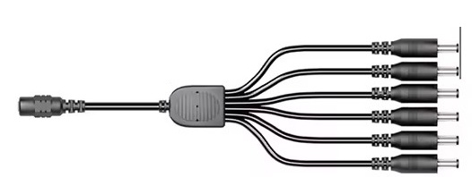
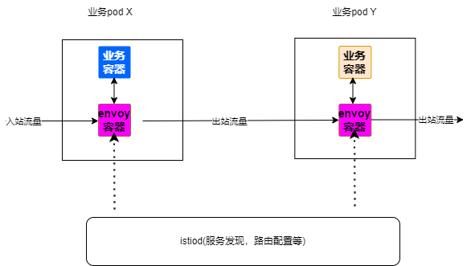
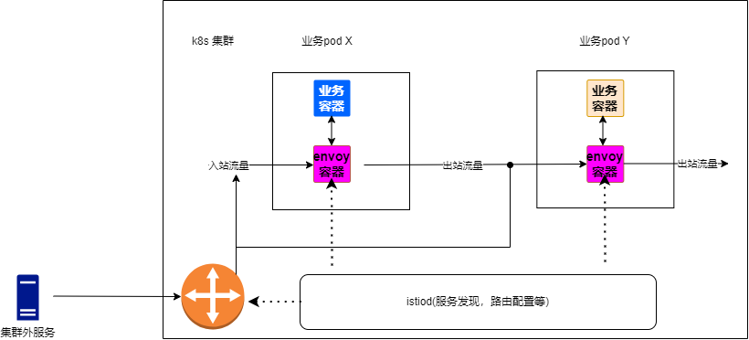

提到 k8s 网关服务，我们一般想到的就是 ingress，不过 istio 作为后起之秀，能够对于服务流量进行更精确的管控，逐渐吸引了更多企业的目光。本文通过简短的介绍来比较两者之间的异同，让你在做技术选项时更加有的放矢。

> 本文原始链接 https://blog.whyun.com/posts/from-ingress-to-istio/ ，转载请注明出处。

## 1. 为何使用 ingress

对于 k8s 服务来说，我们在 [k8s 部署文件简谈](https://blog.whyun.com/posts/k8s-yaml/) 的 1.2 节中讲到可以通过 http://${cluster-ip}:${service-port} 方式来访问集群内部的某个服务。但是这种方式不方便记忆，且服务重新部署后，cluster-ip 会变，所以一般是通过 k8s 的 DNS 功能，将 cluster-ip 转化成域名来进行使用，也就是支持通过 http://${service-domain}:${service-port} 来访问。不过这样我们依然面临一个问题，就是每个服务的端口号是不同的，我们同样需要记忆。

而使用 ingress 就能解决上述问题，ingress 作为一个七层代理服务（底层实现一般是 nginx 、 kong 等服务），还可以把不同的 HTTP 请求路径路由到不同的 service 上。 对于请求者来说只需要记住 ingress 的服务名和端口号即可。

>ingress 部署的时候，可以选择以 service 的模式进行部署。

可以想象 ingress 就是一个电源适配器，通过一个输入端口（ingress自己本身的端口）来适配若干输出接口（service的端口号）。

图 1.1

这时候我们就可以只记住一个 IP （ingress 的 service ip）和一个端口号（ingress 的端口号）就能访问 k8s 中的若干服务了。同时我们就可以像使用nginx 一样，通过配置类似于 upstream 的代码块来将 k8s 服务映射为一个域名，方便进行管理。

ingress 虽然好，但是却有一些硬伤无法避免，首当其冲的就是其中心化的特性，假设我们将图 1.1 的中间节点切断的化，则 ingess 后面所有的端口都会不可达。在正式环境中我们部署应用的时候，都会部署多实例，但是所有的流量依然得流经前置的 ingress 才能到达 pod 中。如果 ingress 这个时候因为某个应用流量过大，被打垮的化，所有通过其访问的服务都会受到牵连。所有在高并发场景下，我们必须考虑 ingress 的承载能力，虽然它并不不承载业务代码。

> 如果你使用云托管的 k8s 集群化，使用 ingress 会被单独收费。

## 2. 为何使用istio
服务网格，常见的解决方案 istio，提供了对于 k8s 更见细粒度的治理方式，

**图 2.1**

它借助 k8s 中“边车模型”，在一个 pod 中放置两个容器：一个专门做流量管控的容器（里面部署 envoy 服务），一个做业务逻辑处理的容器。入站流量先进入 envoy 容器，然后再转发到业务容器中。这种结构虽然规避了中心化这个弱点，但是也只能在 k8s 集群内部使用。在 k8s 集群外部，依然要经过 isito gateway 来转发流量：

**图 2.2**

istio 目前更大的作用是利用虚拟服务（VirtualService）和流量路由规则，用在做金丝雀发布、蓝绿部署、A/B 测试等。如果要想真正的实现去中心化，还是得使用 [Cilium](https://github.com/cilium/cilium) 这种技术，由于笔者在实践中并没有用到这个技术，这里不深入展开讨论。
