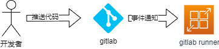
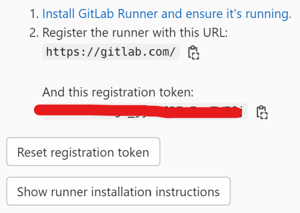
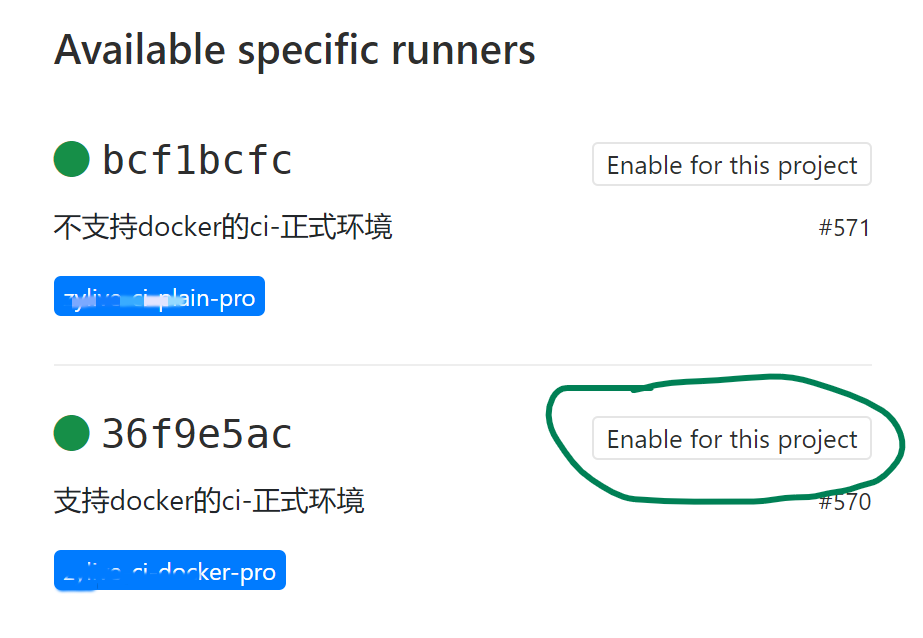

由于现在大多数公司使用私有化 git 仓库产品时一般选择 gitlab，所以借助其提供的 gitlab ci 功能来做 CI (**C**ontinuous **I**ntegration，可持续集成) 任务还是比较普遍的一种选型。本篇文档作为一个 gitlab 的入门教程，会设计到 gitlab runner 和 gitlab-ci.yml 文件的编写两部分内容。

## 0. 能做什么

gitlab ci 作为 CI 技术中的一种，其工作场景其实就是讲 CI 的工作场景，以下两个案例是大家都会用到的情况。

首先我们在开发的过程中需要保证提交到远程代码仓库中每一行代码都是可用的，虽然这个目标看上去是很难实现的，但是通过技术手段让这个尽量的往这个目标上去靠近。这个技术手段就是单元测试，离这个目标到底还差多少，可以通过测试覆盖率来衡量。CI 功能可以做到你每次提交代码到远程仓库的时候，可以触发预先设定好的测试用例，并且在测试用例运行完成后生成覆盖率报告。如果测试用例运行过程中出错，还可以通过邮件来通知当前项目的开发者。

其次，我们在开发到一个阶段的时候，需要将项目源代码进行构建，生成可以被运行的软件产物。如果是客户端程序的话，这个产物可以客户端安装包；如果是服务器端程序的话，这个产物可以是 docker 镜像。然后我们还期望将这些产物推送到特定的服务器上去，以待发布的时候进行使用。

## 1. 在哪里执行

在 gitlab 项目根目录中添加 gitlab-ci.yml 文件后，则会开启 gitlab 的自带 CI 功能。首先给出一个典型的 yaml 文件的示例：

```yaml
variables:
  CI: 1

stages:
  - test

job:test:
  stage: test
  tags:
    - my-test-runner
  script:
    - make test
```

**代码 1.1**

`job:test` 为当前 CI 中一个可以其他被运行的 job，我们首先看其第 9 行的 tags 属性，这个属性并不是指 git 的 tag 名字，而是指 `gitlab runner` 的 tag 名字。gitlab ci 会在开发者操作 gitlab 仓库的时候被触发，触发执行的所有脚本内容都会交由 `gitlab runner` 所执行，整个流程可以如下所示：



**图 1.1**

`gitlab runner` 是一个安装程序，需要作为服务安装在某台机器上做开机自启动，具体的安装教程，可以参见官方文档 [Install GitLab Runner | GitLab](https://docs.gitlab.com/runner/install/) 。同时 `gitlab runner` 本身

安装完成后，需要将当前要建立  CI 的 gitlab 项目和 `gitlab runner` 之间建立联系，这个步骤在 `gitlab runner` 中称之为注册。拿 Linux 系统举例，你需要在 gitlab runner 所在机器上运行如下格式的命令：

```shell
gitlab-runner register \
 --non-interactive \
 --url "https://托管gitlab的域名/" \
 --registration-token "runner的密钥，需要从 gitlab CI/CD 设置中获取" \
 --executor "shell" \
 --description "当前runner的描述信息" \
 --tag-list "tag-name-for-current-runner" \
 --run-untagged="false" \
 --locked="false"
```

**代码 1.2**

将 **代码 1.2** 中的参数依此从上往下看，`url` 参数比较好理解，就是当前托管 gitlab 的 url 前缀。

`registration-token` 这个参数，需要着重讲一下，gitlab 中的 runner 的作用域并不是固定关联到具体某一个项目上，根据需要可以还可以关联到组上和全局上。对于组级别的 runner，按照如下路径可以找到 token 的配置：**具体的某个Group** -> **Settings** -> **CI/CD** -> **Runners**，不过你需要有组的管理权限才能看上 Settings 菜单；全局 runner，在 gitlab 中称之为 shared runner，其配置的 **Settings** 菜单从网站头部 **Menu** 菜单中点击 **Admin** 菜单就可以看到，不过你需要有超级管理员权限，否则 **Admin** 菜单不会显示；项目专属的 runner，可以在项目首页左侧直接找到 **Settings** 菜单，不过你需要拥有当前项目的 maintainer 权限，否则这个菜单也看不到。如果上述三个权限，你至少拥有一个话，就能看到如下界面：

 

**图 1.3**

**图 1.3** 中涂掉的部分就是 `registration-token`，`Register the runner with this URL` 部分就是 `url` 参数的值。

`executor` 参数代表当前 runner 的运行模式，默认为 `shell` 模式，代表在 runner 所在机器上的 shell 环境（Linux 下默认为 bash）中运行。`executor` 其他常见的可选值还包括，`ssh` 模式，这种情况 `gitlab runner` 将被当成一个“跳板机”，通过 ssh 和目标机器进行通信，然后在目标机器上来执行所有脚本命令，这时候为了保证 ssh 的正常通信，你还需要指定 `ssh-host` `ssh-port` `ssh-user` 和 `ssh-password` 或者 `ssh-identity-file` 参数。还有一个常见的 `executor` 为 docker 模式，这种模式下你可以直接在 gitalb-ci.yml 中指定某一个 job 运行所需的镜像名称，显得比较灵活，不过这种模式下，需要你的 runner 机器安装 docker 环境。其他 `executor` 的选项，可以参见官方文档 [Executors | GitLab](https://docs.gitlab.com/runner/executors/index.html)

`tag-list` 可以给当前 runner 打上一个或者多个标签，多个标签之间使用逗号分隔，**代码 1.1** 中指定了 tags 参数为 `my-test-runner` 后，则必须在所有注册中 runner 中拥有一个 tag 列表中含有 `my-test-runner` 的 runner，否则当前 CI 任务会因为找不到 runner 而无法运行。 

`run-untagged` 为 true，则代表某个 job 即使没有配置 tags 属性，也可以运行在这个 runner 上。

`locked` 参数对于项目专属的 runner 来说，用的频率会多一些，它代表当前 runner 仅仅只能用在当前关联的项目上，默认这个值为 true，如果你想将这个 runner 用在跟其同组的其他项目上，可以将其置为 false。对于组级别的 runner 来说，这个参数应该设置为 false，无法给组下的应用使用。

如果由于误操作创建了错误的 runner，你需要使用 unregister 命令取消注册，其使用命令格式为 `gitlab-runner unregister --url ${URL} --token ${token}`，注意这里的 `${token}` 参数并不是 **代码 1.2** 中的 `--registration-token` 的值，而是要通过运行 `gitlab-runner list` 获取到。举一个例子运行完 `gitlab-runner list` 后，得到如下输出：
```
Listing configured runners                          ConfigFile=/etc/gitlab-runner/config.toml
manage-ui-test                                      Executor=ssh Token=abcdef URL=https://some.com.yours
```
则取消 manage-ui-test 注册，就需要运行 `gitlab-runner unregister --url =https://some.com.yours --token abcdef`。
如果设置了组级别的 runner，在组下的具体某一个项目中要手动启用它，否则在运行 CI 的时候会提示没有绑定任何 runner。具体启用方式比较简单，在要操作的项目的设置里面找到 `CI/CD`，点开 `Runners` 按钮，会有如下显示界面：

**图 1.4**
在上图界面中找到需要的 runner，然后点击按钮 `Enable for this project` 即可将当前 runner 在此项目中启用。
## 2. 在何时执行

在 **代码 1.1** 中，我们没有指定当前 job 运行的时机，这样会导致你做任何代码提交操作都会触发这个 job，有可能会导致任务执行的过于频繁。我们一般都会在每个任务上指定运行条件，来防止任务被无味的执行导致耗费 runner 机器的资源。

为了讲运行时机，我们首先要普及一下 pipeline 的知识，首先留意到 **代码1.1** 中指定了 stages 属性，由于上述代码作为一个入门示例每个写过于复杂，现在我们将其丰富一下，stages 属性指定两个值：

```yaml
variables:
  CI: 1

stages:
  - test
  - build

job:test:
  stage: test
  tags:
    - my-test-runner
  script:
    - make test
job:build:
  stage: build
  tags:
    - my-build-runner
  script:
    - make build
```

**代码 2.1**

stages 中现在有两个元素 `test` 和 `build`，并且 `job:test` 和 `job:build` 的 stage 属性分别为上述值，则 `job:build` 将会在 `job:test` 之后执行，这种 job 之间的执行流水线在 gitlab 中称之为 pipeline。

讲完 pipeline，继续回到运行时机的概念，gitlab ci 中使用 rules 属性来确定某一个 job 的运行时机。

```yaml
job:build:
  stage: build
  tags:
    - my-build-runner
  rules:
    # push feature 分支的时候触发
    - if: $CI_COMMIT_BRANCH =~ /^feature/
    # git tag 名称以 v 开头的时候触发
    - if: $CI_COMMIT_TAG =~ /^v/
    # merge request 的时候触发
    - if: $CI_MERGE_REQUEST_SOURCE_BRANCH_NAME
  script:
    - make build
```

**代码 2.2**

上述代码仅仅给出了一个简单示例，代表当前提交的分支以 `feature` 开头，或者提交的 git tag 以 `v` 开头时，或者当前触发了 merge request 时，都会触发 `job:build`。

rules 属于 gitlab 在 12.3 版本引入的特性，在此版本之前的 gitlab 使用 only 和 expect 属性来指定运行时机，比如说 `if: $CI_COMMIT_BRANCH =~ /^feature/` 可以转化为:

```yaml
only:
  - /^feature/
```

更加复杂的使用示例参见 [Choose when to run jobs | GitLab](https://docs.gitlab.com/ee/ci/jobs/job_control.html) 。

## 3. 代码复用

为了应对软件开发的各个生命周期，软件开发团队都会设立几个运行环境，以便在不同阶段对于软件进行验证。比如说说我们会设立开发、测试、正式三个环境，我们的代码在每个生命周期都需要被验证可用性，且这个三个环境用的 git 分支或者 runner 的执行的机器等因素是不同的，但是执行测试的步骤却是相同的。这就牵扯到一个问题，CI 配置文件是否可以像写普通代码一样，做到代码复用呢。答案是可以的。

gitlab-ci.yml 支持 yaml 文件的 `锚点` 语法，首先举一个例子：

```yaml
# 收集覆盖率的公共代码，
# 具体参见https://docs.gitlab.com/ee/ci/pipelines/settings.html#test-coverage-parsing
.coverage-collection: &coverage_expression
  coverage: /All\s+files[^|]*\|[^|]*\s+([\d\.]+)/

job:test-dev:
  stage: test
  variables:
    DEV_TYPE: dev
    GIT_BRANCH: development
  tags:
    - ci-plain-dev
  only:
    - development
  script:
    - make pull
    - make coverage
  <<: *coverage_expression
job:test-master:
  stage: test
  variables:
    DEV_TYPE: test
    GIT_BRANCH: master
  tags:
    - ci-plain-test
  only:
    - master
  script:
    - make pull
    - make coverage
  <<: *coverage_expression
job:test-pro:
  stage: test
  variables:
    DEV_TYPE: pro
    GIT_BRANCH: production
  tags:
    - ci-plain-pro
  only:
    - production
  script:
    - make pull
    - make coverage
  <<: *coverage_expression
```

**代码 3.1**

由于在不同环境下收集测试覆盖率的代码是相同的，所以这里做了一个 `coverage_expression` 的锚点方便下面的 job 做引用，同时锚点前面的 `.coverage-collection` 名称一定要以 `.` 开头，否则 gitlab ci 会将其当成普通 job 来执行。

由于 gitlab ci 的知识点比较多，其他未讲到的内容，可以从官方教程中自行查找 [GitLab CI/CD | GitLab](https://docs.gitlab.com/ee/ci/) 。

## 4. 项目引用

为了代码复用，我们在开发过程中会将部分通用代码单独抽离为一个模块，然后将这个模块的代码单独创建一个项目。这样其他项目就可以将此模块项目作为当前项目的依赖包来引入，从而提高代码的复用性和可维护性。

在很多语言中这种依赖模块是可以通过 git 格式的地址进行引入的。如此依赖，我们在 CI 构建过程中就需要操作两个项目的源代码，当前项目代码和依赖项目代码。当前项目代码在 CI 过程中是可以直接拥有权限的，那么其依赖的模块项目应该如何获取权限呢？

方法有两种，首先是在 gitlab 中配置一个部署密钥，然后将部署密钥对应的私钥配置到 CI 环境中，这样当模块项目启用这个部署密钥的时候，就能保证在 CI 中能正常 clone 当前模块项目。

其次就是一个零配置的方法，就是使用 [CI_JOB_TOKEN](https://docs.gitlab.com/ee/ci/jobs/ci_job_token.html) 。同时增加一个 before_script 配置：

```yaml
before_script:
    - echo -e "machine your_gitlab_domain\nlogin gitlab-ci-token\npassword ${CI_JOB_TOKEN}" > ~/.netrc
    - git config --global url."https://your_gitlab_domain/".insteadOf "git@your_gitlab_domain:"
```

**代码 4.1**
CI_JOB_TOKEN 的权限的权限和当前 CI 的触发者的权限一致，所以只要执行 CI 的人也有当前以来项目的仓库 clone 权限，即可使用 CI_JOB_TOKEN 的模式 clone 此依赖包。

## 5. 缓存 CI 生成产物

我们在 CI 中不可避免的要安装程序依赖文件，对于普通项目来说，依赖的安装很可能会等待比较久的时间。其实大多数情况下，我们每次运行 CI 时，依赖列表不会变动，这时候可以利用 gitlab 的缓存机制来讲安装的依赖文件做缓存。

