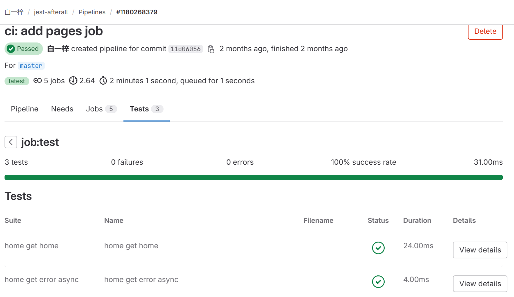
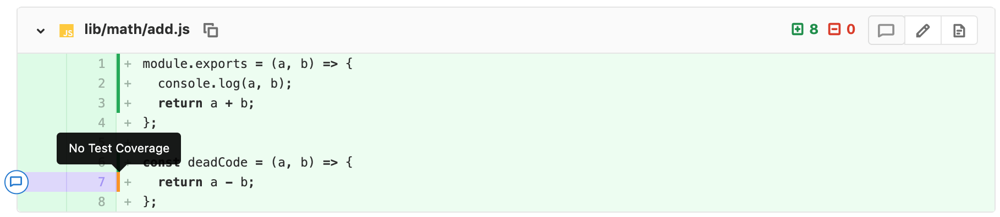

大家使用 CI 的另外一个重要目的就是对于提交代码自动触发单元测试，以保证提交代码的质量和安全性，同时我们还希望收集到每次单元测试运行后的测试覆盖率，如果能够将可视化的显示哪行代码被测试过了，就更好不过了。
## 1. 实现方式
### 1.1 一个简单示例

```yaml
image: node:latest

variables:
  CI: 1

# Caches
.node_modules-cache: &node_modules-cache
  key:
    files:
      - yarn.lock
  paths:
    - node_modules
  policy: pull
  
.check_node_modules:
  script: &check-node-modules
    - |
      set -v
      echo "check cache..."
      if [ -d node_modules ] ; then
        echo "show 10 deps:" && (ls node_modules/ | head) && echo "cache exist"
      else
        yarn install
      fi

stages:
  - prepare
  - test
  - deploy

.when-to-run: &when_to_run
  rules:
    - if: $CI_COMMIT_MESSAGE !~ /^\d+.\d+.\d+/
    - if: $CI_COMMIT_TAG =~ /^v\d+.\d+.\d+\S*$/

# prepare
job:prepare:
  stage: prepare

  script:
    - yarn install
    - npm run eslint
  cache:
    - <<: *node_modules-cache
      policy: pull-push # We override the policy
  allow_failure: false
  <<: *when_to_run

# test
job:test:
  stage: test

  coverage: '/All files[^|]*\|[^|]*\s+([\d\.]+)/'
  variables:
    NODE_ENV: test
  before_script:
    - *check-node-modules
  script:
    - npm run test:ci
  artifacts:
    when: always
    reports:
      junit: junit.xml
      coverage_report:
        coverage_format: cobertura
        path: coverage/cobertura-coverage.xml
    paths:
      - coverage/lcov-report
  cache:
    - <<: *node_modules-cache
  allow_failure: false
  <<: *when_to_run
  dependencies: []
```
**代码 1.1.1**

这里重点关注 test 这个 job，其 artifacts 属性中包含了两个报告 junit 和 cobertura。前者用来展示每条测试用例是否测试通过

**图 1.1.1**
通过上图可以看到我们测试代码中的 3 条用例都通过了（屏幕空间有限，只截取了两条）。
cobertura 是用来展示 merge request 的代码的测试覆盖率情况，不过此覆盖率只显示提交的代码中新增代码的覆盖率情况，当前提交前的代码的覆盖率情况不包含。

**图 1.1.2**

### 1.2 使用 pages 展示完整代码覆盖情况
图 1.1.2 中展示的是提交 merge request 时新增代码的覆盖率情况，如果想看整个项目完整代码的覆盖率情况，可以把项目覆盖率文件上传到 gitlab 的 [GitLab Pages | GitLab](https://docs.gitlab.com/ee/user/project/pages/) 中。要想实现的化需要在 .gitlab-ci.yml 增加一个名称为 pages 的 job（这个名称必须为 pages），然后将生成的覆盖率报告的 html 文件夹拷贝到 public 目录中，同时将 public 文件夹设置为 artifacts 的路径。

```yaml
pages:
  stage: deploy
  script:
    - mv coverage/lcov-report public
  artifacts:
    paths:
      - public
```
**代码 1.2.1**

## 示例代码
本项目的示例代码可以参见 [白一梓 / jest-afterall · GitLab](https://gitlab.com/yunnysunny/jest-afterall) 。
