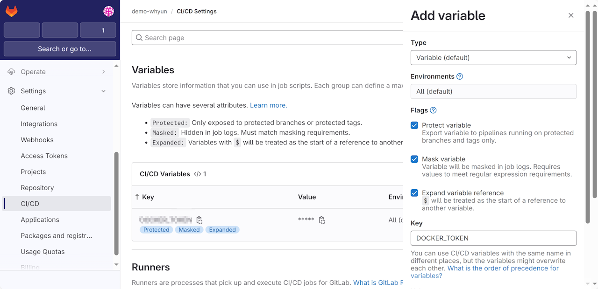

gitlab runner 可以创建 shell ssh docker 这三个创建的模式。如果 runner 安装在自己托管的机器上，那么可以根据需要任意选择模式进行使用，如果你的 runner 是使用云上托管的平台，默认提供了 docker 模式，你可以使用子托管的 runner 来使用你想要的任意模式。使用 shell 模式可以直接将命令运行在 runner 安装的机器上，省去了启动 docker 容器的时间，同时可以直接读取本机上的应用程序和磁盘文件，省去了一些初始化配置的时间。但是如果当前 runner 是多个项目组混用，那么将凭证之类的数据放置到磁盘上可能会引起冲突或者隐私泄露，这时候 docker 模式的隔离特性就凸显出来优点了。所以说在很多情况下 docker 模式是必不可少的。

## 1. 初始配置

为了能在 gitlab runner 的机器上运行 docker 容器，首先需要配置 docker 环境。首先将 gitlab 用户添加到 docker 用户组中：
```shell
sudo usermod -aG docker gitlab-runner
```
**命令 1.1**

运行完成后通过下述命令可以验证 gitlab 用户是否可以：
```shell
sudo -u gitlab-runner -H docker info
```
**命令 1.2**

如果能正常输出信息，则证明添加成功：
```
Client:
 Context:    default
 Debug Mode: false
 Plugins:
  buildx: Docker Buildx (Docker Inc.)
    Version:  v0.10.2
    Path:     /usr/libexec/docker/cli-plugins/docker-buildx
  compose: Docker Compose (Docker Inc.)
    Version:  v2.16.0
    Path:     /usr/libexec/docker/cli-plugins/docker-compose
  scan: Docker Scan (Docker Inc.)
    Version:  v0.23.0
    Path:     /usr/libexec/docker/cli-plugins/docker-scan
```
**输出 1.1**

接着在 gitlab runner 机器上注册一个 runner 实例：
```shell
sudo gitlab-runner register  \
--non-interactive \
--url https://gitlab.com  \
--token glrt-gKCEdSG4si4zdfr-Ryfy \
--executor docker \
--description "My Docker Runner" \
--docker-image "docker:20.10.16" \
--docker-privileged
```

这里注册的时候选择的默认镜像为 docker，这个镜像内部可以使用 docker 命令，用于实现 docker 镜像构建、推送等功能。用户在 .gitlab-ci.yml 文件中可以通过指定 job 的 image 属性来替换成其他自己所需的镜像。
> 这里使用了 20.10.16 版本的 docker 镜像，官方给的说法是这个版本确保跟 gitlab 兼容，使用其他版本可能会有意外情况产生，最新版的官方[文档](https://docs.gitlab.com/ee/ci/docker/using_docker_build.html#use-docker-in-docker)已经将其修改为 24.0.5，老版文档中给出的是 20.10.16 版本，读者可以根据实际情况选择。
## 2.使用示例

### 2.1 构建镜像

```yaml
variables:
  DOCKER_AUTH_HOST: 'https://index.docker.io/v1/'
  REGISTRY_GROUP: 'yunnysunny'
  DOCKER_AUTH_CONFIG: '{"auths": {"${DOCKER_AUTH_HOST}": {"auth": "${DOCKER_TOKEN}"}}}'
  VERSION_PREFIX: 'v'

stages:
  - build

job:image:
  stage: build
  tags:
    - gitlab-com-docker
  before_script:
    - mkdir -p $HOME/.docker && echo $DOCKER_AUTH_CONFIG > $HOME/.docker/config.json
  script:
    - VERSION=${CI_COMMIT_REF_NAME#$VERSION_PREFIX}
    - REGISTER_IMAGE=$REGISTRY_GROUP/cn-alpine:$VERSION
    - docker build -t $REGISTER_IMAGE -f ./Dockerfile .
    - docker push $REGISTER_IMAGE
  allow_failure: false
```
**代码 2.1.1**

DOCKER_AUTH_CONFIG 是 gitlab 的约定的变量，如果你的镜像来自私有仓库，正确的设置这个变量可以让你能够成功拉取到指定镜像（具体参见官方[文档](https://docs.gitlab.com/ee/ci/docker/using_docker_images.html#access-an-image-from-a-private-container-registry)）。这里我们使用的是 docker hub 的镜像仓库，拉取的是公开的镜像，所以这个变量在这里没有体现出来用户。



**图 2.1.1**

另外 DOCKER_AUTH_CONFIG 中的 DOCKER_TOKEN 是 docker 的鉴权凭证，格式为 BASE64 形式，可以现在一台机器上通过 docker login 登录你的账号，然后查看 ~/.docker/config.json，将其中的 BASE64 值拷贝出来，在 gitlab 组中配置一个变量，如上图所示。

在 job:image 中的 before_script 中，将 DOCKER_AUTH_CONFIG 写入了 docker 容器内的 ~/.docker/config.json 中，是因为 docker in docker 模式无法读取到 gitlab variables 中定义的环境变量，必须手动写入 docker 的鉴权文件。

写完代码后把代码推送到 gitlab，然后查看 CI 运行状态，会发现 docker build 会直接报错：

```
error during connect: Post "http://docker:2375/v1.24/build?buildargs=%7B%7D&cachefrom=%5B%5D&cgroupparent=&cpuperiod=0&cpuquota=0&cpusetcpus=&cpusetmems=&cpushares=0&dockerfile=Dockerfile&labels=%7B%7D&memory=0&memswap=0&networkmode=default&rm=1&shmsize=0&t=yunnysunny%2Fcn-alpine%3Amain&target=&ulimits=null&version=1": dial tcp: lookup docker on x.x.x.x:53: no such host
```

这是由于我们的 docker 命令运行在 docker 镜像中无法与宿主机中真正的 docker 守护程序进行通信，需要修改一下 gitlab-runner 中 config.toml ， 将守护程序监听的 Unix Socket 路径挂载在 runner 启动的容器上：

```toml
[[runners]]
  name = "My Docker Runner"
  url = "https://gitlab.com"
  id = xxxx
  token = "yyyy"
  token_obtained_at = 2023-12-16T12:54:50Z
  token_expires_at = 0001-01-01T00:00:00Z
  executor = "docker"
  [runners.cache]
    MaxUploadedArchiveSize = 0
  [runners.docker]
    tls_verify = false
    image = "docker:20.10.16"
    privileged = true
    disable_entrypoint_overwrite = false
    oom_kill_disable = false
    disable_cache = false
    volumes = ["/var/run/docker.sock:/var/run/docker.sock","/cache"]
    shm_size = 0
    network_mtu = 0
```
**代码 2.1.2**

注意 `volumes` 属性，这里增加了一个 Unix Socket 地址映射，这样容器中的 docker 命令就可以和宿主机中的 docker 守护程序进行通信了。

### 2.2 使用自定义镜像

很多情况下，我们除了构建镜像外，还会执行运行单元测试、做代码质量校验等任务，所以我们使用的镜像中肯定要加入其他程序。下面演示在 docker 镜像里面加 Node 运行环境的 Dockerfile 的例子：

```dockerfile
FROM docker:20.10.16-git
LABEL used-for="ci"
ARG NPM_MIRROR=//registry.npmmirror.com
ARG NPM_REGISTRY=https:${NPM_MIRROR}
RUN git config --global user.email "ci@your-company.com" && git config --global user.name "ci-user"

RUN sed -i 's/dl-cdn.alpinelinux.org/mirrors.ustc.edu.cn/g' /etc/apk/repositories
RUN apk add --update --no-cache gcc g++ make python3 openssh-client \
 libgcc libstdc++ wget tar xz bash

# node
ARG NODE_VERSION=18.19.0
RUN wget https://unofficial-builds.nodejs.org/download/release/v$NODE_VERSION/node-v$NODE_VERSION-linux-x64-musl.tar.xz \
  && tar -xJf node-v$NODE_VERSION-linux-x64-musl.tar.xz -C /usr --strip-components=1 --no-same-owner \
  && rm -rf node-v$NODE_VERSION-linux-x64-musl.tar.xz

# npm config
RUN npm config set registry ${NPM_REGISTRY} \
  && npm i yarn -g \
  && npm cache clean --force \
  && yarn config set registry ${NPM_REGISTRY}
```
**代码 2.2.1**
