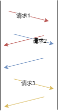

---

abbrlink: k8s-yaml
title: 不同版本 http 协议 TCP 实现方式解析 
date:  2022-08-06
description: 从 http 1.0 开始，http 历经了 1.1 2.0 3.0 版本，每个版本迭代升级的时候，都会对传输层的使用模式加以改进，本文就是从这个方面讲一下各个版本在传输层的异同。
categories:

- [HTTP,TCP]

---

HTTP 协议从 1.0 开始历经了 1.1 2.0 3.0 这些重大版本改动。其实 2.0 的标准的落地也就最近几年的事情，我们开发的后端 HTTP 服务大都还是延用的 HTTP 1.x 的版本，对于 2.0 的涉猎比较少，不过就在前些天 3.0 版本协议已经正式推出了。那么协议制定者在对各个版本的 HTTP 协议升级的时候，都出于何种设计理念，我们在平时使用的时候，又该如何合理利用这些优秀的设计思想，这篇文章就是对此做出解答。

## 1. 协议

## 1.0 HTTP 1.0

1.0 版本遵循的理念是一次一连接，也就是每次请求都需要重新建立一条 TCP 句柄。因为 HTTP 协议本身没有涉及事务相关的内容，这种模型对于服务端和客户端来说实现起来比较简单。同时由于连接用完即释放，可以在单位时间内服务更多终端访问者，尽可能的减少句柄数使用。

**图 1.1.1**

## 1.1 HTTP 1.1

由于 HTTP 1.0 每次请求的都会新建句柄，不可避免的要进行 TCP 三次握手过程和慢启动过程，会浪费掉很多宝贵的时间，特别是一个网页上有很多资源需要下载的时候，这种不利因素就会被放大。所以 HTTP 1.1 在指定的时候，提出了 keepalive 的概念，请求者在请求头中指定 keepalive 则服务器端就会根据需要将当前连接维持住一段时间。但是这个时间到底多长，协议中没有严格规范。不过一旦开启了这个特性，就代表要在一条连接上承载多个请求，由于 HTTP 协议没有请求序号的概念，为了帮助请求者将请求和响应配对，服务器端会按照请求顺序来发送响应数据包，即使某个先到请求 X 处理的时间超长，其后到的请求 Y 已经处理完了，也要发完 X 的响应后才能发 Y 的响应。

我们称这种现象为队头堵塞现象。

大家最常用的反向代理服务器nginx 目前支持使用 http 1.0 和 1.1 来做反向代理，并且默认为 1.0 模式。我想除了上面提到的对头堵塞外，1.1 版本还存在连接生命周期不一致的问题。 刚才提到协议中没有严格要求 keepalive 的时长，这就导致了一个问题，客户端无法精确的感知服务端啥时候关闭句柄，虽然你可以在客户端增加传输层的心跳包来试探服务器端的句柄是否可用，但是服务器端却根据客户端是否发送 HTTP 请求来判断客户端是否活跃，一旦服务器端在某一个时间间隔内没有受到当前句柄发过来的 HTTP 请求数据，就会立马断开连接，而这时候客户端恰好发起了一次 HTTP 请求，就会得到一个传输层的 RESET 指令。为了避免这种情况出现，配置 nginx 的时候一定要将 keepalive 时间设置成一个小于服务器端允许最大连接空闲时间的值。

既然 HTTP 1.1 有这样那样的问题，但是出于高性能方面的考量，配置 nginx 反向代理的时候还是应该使用 HTTP 1.1 模式。在高并发场景下，使用 1.0 模式时由于每次建立句柄，但是 Linux 下默认 TCP 握手队列长度为 1024，所以瞬时并发一旦超过 1000 时，就会出现 TCP 握手时间超长的情况出现。

### 1.2 HTTP 2.0

在出 1.1 协议之前，有一个 1.0+ 的协议，keepalive 标准就是在 1.0+ 中提出的，且 1.1 在 rfc 规定默认使用持久连接，然而目前看没有任何一个编程语言按照这个 rfc 来实现。大家都是把 HTTP 1.0+ 的标准搬到 HTTP 1.1 来用。大家在 HTTP 2.0 协议上来真正实现了长连接。

HTTP 2.0 中将一个 HTTP 拆分成若干 frame，每个 frame 都有编号，这样请求和响应之间就不用按照顺序进行匹配了，从而彻底解决了 HTTP 1.x 中的对头堵塞问题。

目前 nginx 中实现了 HTTP 2.0 的请求处理功能，但是不支持反向代理到 HTTP 2.0 编写的服务器，虽然它支持反向代理到 GRPC（一个基于 HTTP 2.0 和 protobuf 的编程框架） 编写的服务器。

### 1.3 HTTP 3.0

从 HTTP 1 到 2 ，都是 TCP 协议构建，TCP 协议由于历史悠久，背上了好多历史包袱，比如说慢启动问题、丢包重传算法低效问题。

为了解决上述问题，谷歌提出了 QUIC 协议，其使用 UDP 协议对 TCP 进行重写，HTTP 3.0 就是基于 QUIC 协议基础实现。HTTP 3.0 的实现很好的提升了移动互联网带来的弱网环境的传输效率。
