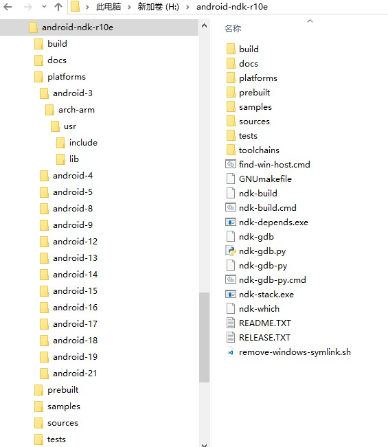
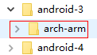
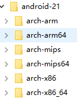

## 3.1 背景
谈到JNI的使用场景，最常用的就是android NDK的编写了。首先从https://developer.android.com/ndk/downloads/index.html#download 把最新版的NDK下载下来。下载完之后得到一个exe文件，这其实是一个自解压文件，运行后自动解压，解压完成后的文件夹有3GB，所以你的磁盘空间起码得留足5GB左右的剩余空间。
最终我们得到这么一个目录结构：

  
**图3.1.1 ndk目录结构**  
接着需要将ndk所在目录添加到环境变量PATH中，这样在以后运行的时候，只需要输出`ndk-buld`就可以了。文件夹`plantforms`存放着编译各个版本的android所需的头文件和动态库，举个例子`platforms/android-3/arch-arm`文件夹下存放的是`android 1.5`版本的`arm`平台的头文件和库文件，从`android 2.3`开始，开始支持`x86`和`mips`两个平台，所以在`platforms/android-9`目录下会有`arch-arm` `arch-mips` `arch-x86`三个文件夹。

> 本文源地址：https://blog.whyun.com/posts/jni-ndk/ 转载请注明出处。

## 3.2 Android.mk
mk后缀的文件是makefile文件，mk文件一般通过`include`语法被引入到其它makefile中。在NDK中Android.mk里存储的都是编译相关的配置信息，我们先举一个例子：
```
LOCAL_PATH := $(call my-dir)

include $(CLEAR_VARS)

LOCAL_MODULE := chapter3
LOCAL_CFLAGS := -DJNI_ANDROID
LOCAL_LDLIBS := -llog -lm
TARGET_ARCH := arm
TARGET_PLATFORM := android-7
LOCAL_SRC_FILES := chapter3.c 

$(info $(SYSROOT))
include $(BUILD_SHARED_LIBRARY)
```
文件第一行中`my-dir`是一个函数，通过调用它返回当前路径，`CLEAR_VARS`变量指向一个mk文件，它会清除所有除了`LOCAL_PATH`之外的`LOCAL_`开头的变量，下面是一些列的对于`LOCAL_`开头的变量的定义：

- LOCAL_MODULE 定义当前生成模板的名称，注意到文件最后一行`include $(BUILD_SHARED_LIBRARY)`代表当前是要生成一个动态库，所以说将LOCAL_MODULE定义成`chapter3`后，将会得到一个`libchapter3.so`文件。
- LOCAL_CFLAGS 定义编译用到的宏定义，当然也可以使用`-I`来指定头文件路径，不过这个使用`LOCAL_C_INCLUDES`更适合，因为后者可以被断点调试程序gdb识别。
- TARGET_PLATFORM 指定当前使用的API版本，比如说android-9，就会使用NDK文件夹下的`platforms/android-9`中的头文件和库来参与编译（对于API版本和android版本之间的对应关系，可以参见百度百科的词条[Android历史版本](http://baike.baidu.com/view/7902337.htm "")）。
- TARGET_ARCH 指定编译的CPU平台，不同API版本支持的类型不同，越新的API支持的CPU平台就越多，如果想查看当前API版本支持哪几个平台，去`plantforms/android-{API版本号}`中看一下便知道，比如说android-3仅仅支持一个平台`arch-arm`:  
  
**图3.2.1 anroid 1.5支持的cpu类型**  
那么android-3，可选的`TARGET_ARCH`就只有一个`arm`选项。
但是`android-21`就支持6个CPU平台：  
  
**图3.2.2 android5.0 支持的CPU类型**  
这样对于android5.0来说可选的选项包括`arm` `arm64` `mips` `mips64` `x86` `x86_64`
另外如果没有指定这个值的话，就会用默认的`arm`
- LOCAL_LDLIBS 指定要引用的系统库，比如例子中的`-llog`就会引用``plantforms/android-{API版本号}/usr/lib/liblog.so`。
- LOCAL_SRC_FILES 在这里就是要编译的c文件了，如果一行写不开，需要写多行，那么可以在每行的行尾加上 ` \`。
- BUILD_SHARED_LIBRARY 这里代表最终生成的是一个动态库文件。

## 3.3 简单例子
这个例子就是NDK`samples`目录中`hello-jni`项目，将这个项目随便拷贝到某一个目录，然后删除掉项目中的tests文件夹，这个是一个单元测试，我不知道怎么使用它，所以直接删除掉。然后打开eclipse，选择File->Project...->Android->Android Project From Existing Code,选择刚才拷贝后的路径，点击完成。
在命令行中进入项目的jni文件夹，然后运行`ndk-build`，你会发现程序生成了好几个so文件夹，放置于项目的`libs`文件夹中，这是由于在文件`Application.mk`（位于文件夹`jni`中）文件中这一句造成的：  
`APP_ABI := all`  
`ABI`这个参数（可以参见百度百科词条[ABI](https://baike.baidu.com/subview/1433570/6276632.htm "")）比之前讲到的`ARCH`要更加细化，可以理解为在同一体系结构下CPU的不同版本，支持的指令集有所差异，android中支持的ABI可以参见[谷歌官方ABI解释](https://developer.android.com/ndk/guides/abis.html "")。最终在模拟器上运行程序成功：  

  
**图3.3 运行hello-jni项目成功**  
