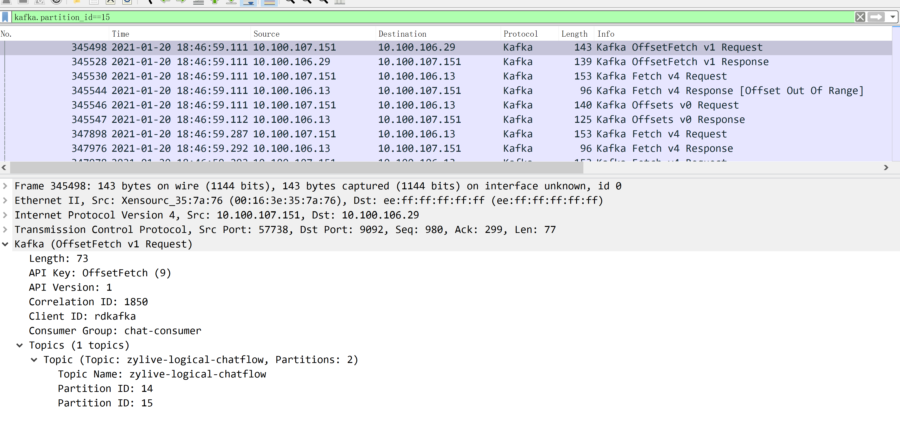
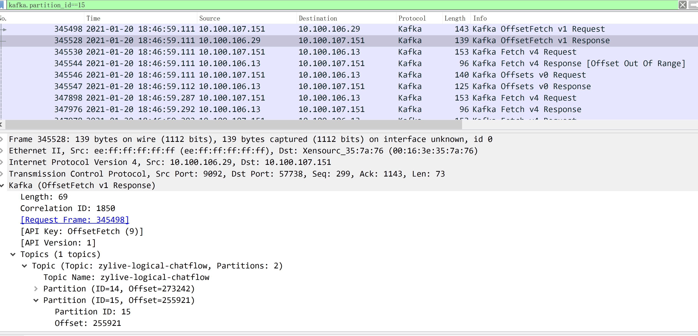
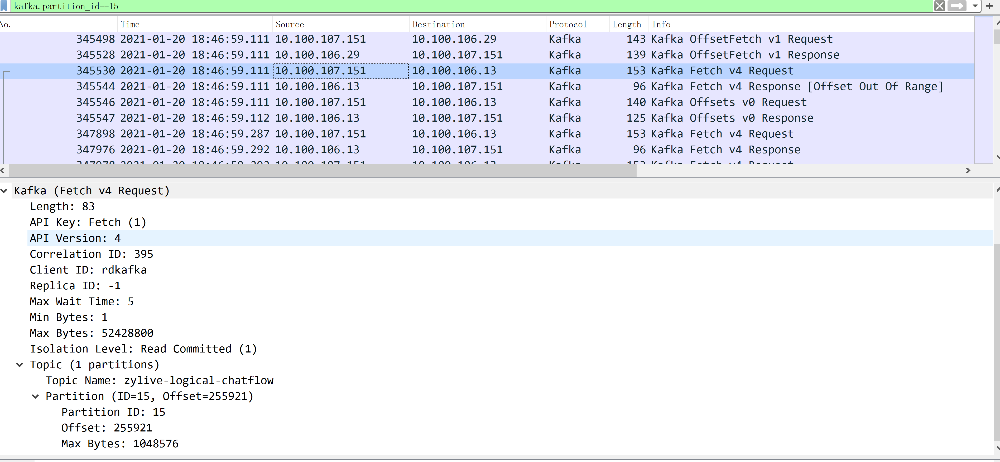
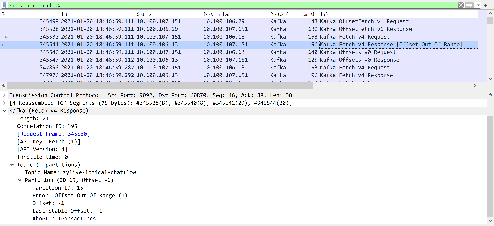
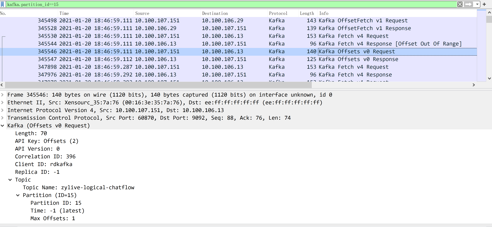
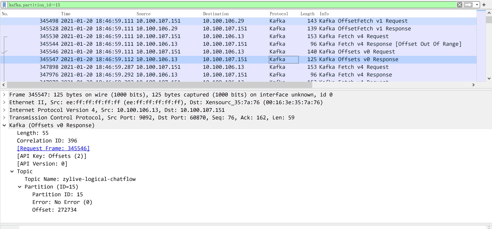
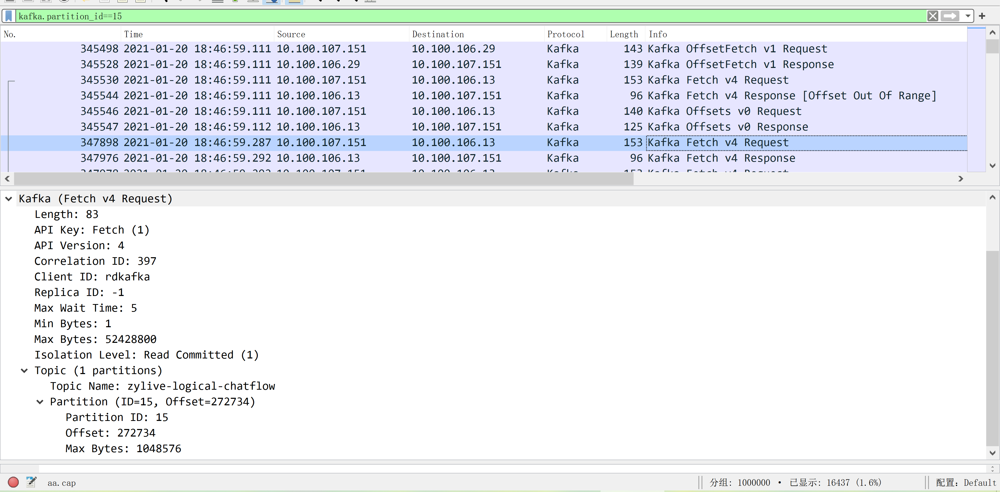
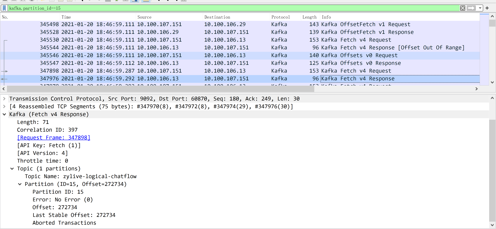
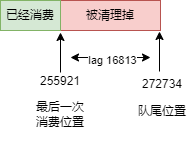

之前使用 kafka 的时候突然发现一个诡异的问题，位于一个 kafka topic 上的消费者的 lag 突然无法下降了，即使重启消费者进程既依然不起作用。初步分析感觉是 kafka 服务器端返回的 offset 数据不对，于是乎对于集群中的所有消费者机器进行抓包，然后重启有问题的 partition 对应的消费者服务。rebalance 完成后，将有问题的那个 partition 对应服务器的网络数据包导出来，在本地进行分析。

但是这个包太大了，载入 wireshark 后机器内存不足会打开失败，需要对原始文件进行拆分（命令：`editcap -c <packets-per-file> <input-pcap-file> <output-prefix>` ），具体参见[这里](https://blog.csdn.net/qq_19004627/article/details/82287172)。然后一次打开每个拆分后的文件，筛选的时候输入 `kafka.partition_id==15` , `15` 就是出问题的那个 partition 。拆分后的文件每个文件都按照这个筛选条件搜索，找到第一个出现问题的分片文件，如果这个命令的关键 TCP 包被截断，可以再和上一个分片做合并(命令格式： `mergecap -w output.pcap input.pcap input2.pcap [input3.pcap . . .]`)。

> 前方高能预警，下面的图片个数比较多

**图 1**

首先看第一个 OffsetFetch 请求，请求 partition `15` 的当前消费进度。

**图 2**

返回的是 `255921`。

**图 3**

客户端就按照 `255921` 这个 offset 去消费队列中的数据。

**图 4**

没有想到服务器端告诉客户端当前 offset 超出正常范围了。

**图 5**

客户端只好重新请求partition `15` 的 offset。

**图 6**

最终客户端给返回的是 `272734`，前后两者相差 `16813`。

**图 7**

客户端又按照 `272734` 去取数据。

**图 8**

由于当前已经到队列末尾了，所以不会得到任何数据。但是在 kafka manager 上显示的 LAG 数目，确是雷打不动的 `16813`，给大家的错觉就是这个消费者程序出 bug 了，不消费数据了。最终大家回忆了一下，应该是凌晨的时候打压，产生了大量的积压数据，但是我们的 kafka `12` 小时候就会自动清理，然后恰好到了 `12` 小时还有 `16813` 条数据没有被消费，就被 kafka 清理线程干掉了，但是 kakfa 记录的消费者的 offset 又确实是 `255921`，所以就带来了如上错觉。

用一张图来总结一下上述问题：

**图 9** 

由于消费者消费能力不足，导致队列中数据超期被 kafka 清除，进而出现消费进度和队列最大 offset 之间产生了一个比较大的空缺。所以从表象上看，消费者不消费数据了，其实仅仅是数据显示问题，只要你往这个出问题的 partition 中写入一条数据，消费者消费出来就会恢复正常，当前 partition 的 lag 就会变为 0。
