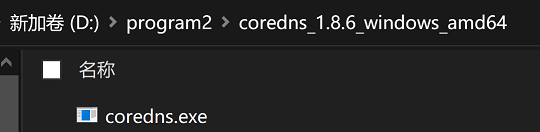

一般公司内部都会有内部 DNS 服务器，由于托管公司内网域名，且会当成公司内部上网的专用 DNS，同时承载外网的域名解析工作。但是有时候公司内网的 DNS 服务不稳定时，就比较尴尬，不用吧，解析不了内网域名，用吧，上不了外网。这时候用 DNS 的分流工具就是解决这个问题的好办法。这篇文章会拿 win10 举例，讲解 coredns 的简单配置，来解决 DNS 分流问题。
## 简单配置

首先下载 coredns 安装包 https://github.com/coredns/coredns/releases/latest 将其解压到本地磁盘


**图 1.1**

这里解压到的是 D:\program2\coredns_1.8.6_windows_amd64\ 这个目录。然后在这个目录中编写 coredns 的配置文件

```
(inner) {
    errors
    # 禁用ipv6解析
    rewrite stop type AAAA A
    cache 3
    forward  . 内网DNS服务的IP
    reload
    log
}

your-company-domain {
    import inner
}

. {
    any
    errors
    health {
        lameduck 5s
    }
    ready
    forward . 119.29.29.29 223.5.5.5
    cache 30
    reload
    log
}
```

为了保证 coredns 能够在windows中开机自启动，还要借助 winsw 这个工具，从 https://github.com/winsw/winsw/releases 中下载最新版本，其中 win10 对应的二进制文件 WinSW.NET461.exe。将 winsw 的二进制文件拷贝到刚才的工作目录，然后重命名为 **coredns-service.exe** 。

接着在刚才的工作目录中创建 coredns-service.xml，输入以下内容

```xml
<service>
  <id>CoreDNS</id>
  <name>CoreDNS Service (powered by WinSW)</name>
  <description>This service is a CoreDNS service</description>
  <executable>D:\program2\coredns_1.8.6_windows_amd64\coredns.exe</executable>
  <workingdirectory>D:\program2\coredns_1.8.6_windows_amd64\</workingdirectory>
  <onfailure action="restart" delay="10 sec"/>
  <startmode>Automatic</startmode>
  <log mode="reset"/>
</service>
```

通过命令 D:\program2\coredns_1.8.6_windows_amd64\coredns-service.exe install 可以在 windows 中将 coredns 安装为系统服务，通过命令 D:\program2\coredns_1.8.6_windows_amd64\coredns-service.exe start 可以在后台启动这个系统服务。上面两个命令只需要在初始化安装的时候执行一次即可，下次开机的时候，就能自动启动 coredns 了，不过需要注意的是运行需要的超管权限。通过命令 D:\program2\coredns_1.8.6_windows_amd64\coredns-service.exe status 可以查看服务状态。

通过命令 nslookup [www.baidu.com](http://www.baidu.com/) 127.0.0.1 ，如果返回如下内容

```
服务器: localhost
Address: 127.0.0.1
非权威应答:
名称:  www.a.shifen.com
Addresses: 163.177.151.109
     163.177.151.110
Aliases: www.baidu.com
```

代表配置成功。

最后一步，修改本地上网网卡所用的 DNS 为 127.0.0.1，在 **控制面板\所有控制面板项\网络连接** 中找到你所用的网卡，右键选择属性，在打开的面板中选择双击 **Internet 协议版本 4** ，填写首选 DNS 为 127.0.0.1


## 使用加密 DNS
DNS 协议默认走 UDP 或者 TCP ，通过明文进行传输。这种传输方式容易被监听或者篡改，解决方法就是使用 DoT(DNS over TLS) 或者 DoH(DNS over HTTPS) 。 CoreDNS 目前仅支持 DoT，如果使用 DoH 需要使用插件，不过有 DoT 已经足够满足需求了。 
```coredns
(inner) {
    errors
    # 禁用ipv6解析
    rewrite stop type AAAA A
    cache 3
    forward  . 内网DNS服务的IP
    reload
    log
}

your-company-domain {
    import inner
}
. {
	any
    errors
	health {
		lameduck 5s
	}
	ready
    forward . 127.0.0.1:53001 127.0.0.1:53002
    cache 30
	reload
	log
}

.:53001 {
    bind 127.0.0.1
    forward . tls://9.9.9.9
    cache
}
.:53002 {
    bind 127.0.0.1
    forward . tls://223.5.5.5 { tls_servername dns.alidns.com }
    cache
}
```
这里 forward 指令写了两个 127 的地址，是由于 CoreDNS 不支持在 forward 上直接写 TLS 地址，所以必须通过在本地建立一个传统 DNS 端口监听，然后将 forward 地址写成这个 127 的地址。另外需要注意阿里云提供的 TLS 地址必须使用域名访问，所以这里还配置了 tls_servername 属性。