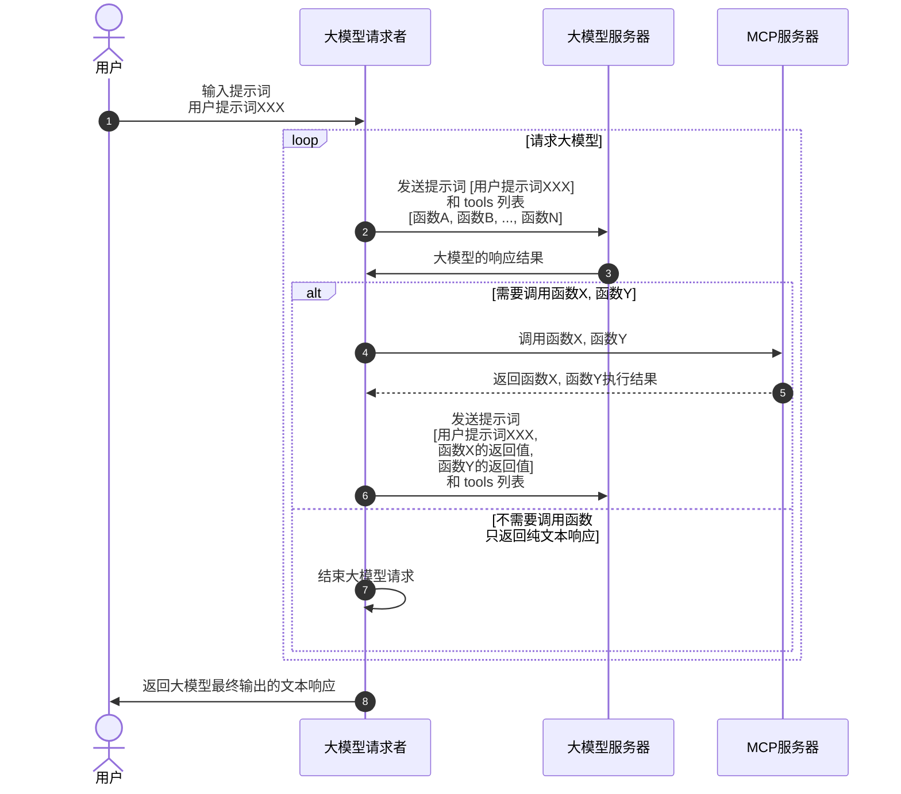

随着智能体这个概念的大火，一个伴随起而来的 MCP 协议也渐渐走入技术人员的视野，这篇教程主要是用来智能体为何要使用 MCP 协议，以及它是怎么一步步演变过来的，适合想入手智能体开发的新手同学。

## 1. 属于大模型提示词的分水岭
大模型可以做人类语言识别、可以做逻辑推理，但是它不能无中生有。比如说你问大模型一个问题，让它帮你查询某个数据库里的某个条件的数据，那是不可能的，大模型的服务不可能也不能连接到你的数据库服务器中来。

在 2023 年前，如果你非要通过大模型来做上述数据库的查询的话，你就得手撸一个提示词，大概长这样：

```
你是一个数据库查询助手。
如果用户给你提供来店铺的名字，并且让你查询它的销量的话，你需要返回如下格式的json 数据：

{"function": "query_sales", "arguments": {"shop_name": "要查询的店铺名字"}}
```

**提示词 1.1**

由于提示词是你自己手撸的，关于它好不好用，就只能自己慢慢 “微调” 了。但是在 2023 年 6 月，OpenAI 发布 gpt-3.5-turbo-0613 的时候，给其 API 提供来 Function Calling 的功能，只需要在请求 API 时传入一个 functions 参数就可以把告诉大模型我本地有哪些支持的函数，就不用再编写手撸的提示词来。紧接着在同年 11 月，gpt-3.5-turbo-1106 发布，API 中提供来 tools 参数，来代替 functions 函数，这也是我们现在在所有大模型 API 文档中看到的样子。我们拿 DeepSeek 的官方文档来举例：

```python
from openai import OpenAI

def send_messages(messages):
    response = client.chat.completions.create(
        model="deepseek-chat",
        messages=messages,
        tools=tools
    )
    return response.choices[0].message

client = OpenAI(
    api_key="<your api key>",
    base_url="https://api.deepseek.com",
)

tools = [
    {
        "type": "function",
        "function": {
            "name": "get_weather",
            "description": "Get weather of an location, the user shoud supply a location first",
            "parameters": {
                "type": "object",
                "properties": {
                    "location": {
                        "type": "string",
                        "description": "The city and state, e.g. San Francisco, CA",
                    }
                },
                "required": ["location"]
            },
        }
    },
]

messages = [{"role": "user", "content": "How's the weather in Hangzhou?"}]
message = send_messages(messages)
print(f"User>\t {messages[0]['content']}")

tool = message.tool_calls[0]
messages.append(message)

messages.append({"role": "tool", "tool_call_id": tool.id, "content": "24℃"})
message = send_messages(messages)
print(f"Model>\t {message.content}")
```

**代码 1.1**

上述代码中第一调用 send_messages 函数，仅仅发送了 user 角色的消息，大模型检查测到当前提示词是问天气的，同时发现传递给大模型的 tools 中恰好含有一个天气处理的函数，于是在返回给调用者你需要使用天气处理函数来查询天气。调用者通过天气处理函数拿到天气描述后，再一次调用大模型，只不过这一次调用的时候除了之前的 user 角色的消息外，又追加了一条 tool 角色的消息，消息的正文是天气的描述信息。在这一次调用完成后，大模型看到提示词中的天气内容已经完成查询了，就会直接输出最终的自然语言返回给调用者，整个流程结束。


**时序图 1.1 tools 参数使用流程**

## 2. MCP 协议
通过 tools 这个参数简化了提示词的编写成本，让大模型和动态数据之间的交互更加灵活。不过在去年，也就是 24 年，智能体这个概念概念兴起，它所借助的也是 tools 这个功能，将传统 API 包裹成 一个个 tools 函数，这样就可以使用问答的模式来调用这些传统 API 了。但是在调用过程中，会发现将传统 API 改成 tools 的话，需要将很多 API 调用代码和大模型提示词的代码耦合在一期，显得不够优雅，且复用程度不高。于是在 2024 年 11 月，Anthropic 发布了 MCP 协议，将 tools 的封装单独抽离到独立的服务器，然后通过远程调用的模式来提供给大模型调用方。

### 2.1 服务器端
一个 mcp 服务器端的例子：

```typescript
export const server = new McpServer({
  name: "weather",
  version: "1.0.0",
  capabilities: {
    resources: {},
    tools: {},
  },
});
server.tool(
  "get-forecast",
  "Get current time weather forecast for a given location",
  {
    latitude: z.number().min(-90).max(90).describe("Latitude of the location"),
    longitude: z.number().min(-180).max(180).describe("Longitude of the location"),
  },
  async ({ latitude, longitude }) => {
	  const forecastText = '24°'
	  return {
	      content: [
	        {
	          type: "text",
	          text: forecastText,
	        },
	      ],
	    };
});
server.tool(
  'get location',
  'Get latitude and longitude from current location',
  {},
  async () => {
    const result = {latitude: 50, longitude: 100};
    return {
      content: [
        {
          type: "text",
          text: `Current Latitude: ${result?.latitude}, Longitude: ${result?.longitude}`,
        },
      ],
    };
  }
);
```

**代码 2.1.1 server.ts**

上述代码只包含单纯函数调用部分，最终这个执行结果还是要通过传输协议发送给请求者，这在 MCP 中被称之为 transport。MCP 协议中定义了 transport 的模式包括 监听标准输出模型、HTTP SSE 、HTTP stream 模式。如果开发者想给本地桌面程序提供 MCP 服务的话，可以直接用 fork 一个子进程，并监听标准输出；如果是服务器端封装大模型调用的话，更合理的方式是通过 HTTP 协议进行调用。这里只演示 HTTP stream 模式的代码封装：

```typescript
import express, { Request, Response } from "express";
import { server } from "./server";
import { StreamableHTTPServerTransport } from "@modelcontextprotocol/sdk/server/streamableHttp.js";

const app = express();
app.use(express.json());


app.post('/mcp', async (req: Request, res: Response) => {
  // In stateless mode, create a new instance of transport and server for each request
  // to ensure complete isolation. A single instance would cause request ID collisions
  // when multiple clients connect concurrently.
  // 这里官方文档说，server 对象要每次创建，否则内部的请求ID会混乱，但是 js 是单线程工作的，即使是并发请求， id 生成也不会出现不安全的情况，故这里没有新建 server 对象。	
  try {
    const transport: StreamableHTTPServerTransport = new StreamableHTTPServerTransport({
      sessionIdGenerator: undefined,
    });
    res.on('close', () => {
      console.log('Request closed');
      transport.close();
      server.close();
    });
    await server.connect(transport);
    await transport.handleRequest(req, res, req.body);
  } catch (error) {
    console.error('Error handling MCP request:', error);
    if (!res.headersSent) {
      res.status(500).json({
        jsonrpc: '2.0',
        error: {
          code: -32603,
          message: 'Internal server error',
        },
        id: null,
      });
    }
  }
});
```

**代码 2.1.2 transport.ts**

写完服务器端代码，就可以测试当前各个 tools 函数是否运行正常

### 2.2 客户端
```typescript
import { Client } from "@modelcontextprotocol/sdk/client/index.js";
import { StreamableHTTPClientTransport } from "@modelcontextprotocol/sdk/client/streamableHttp.js";
import OpenAI from "openai";
import { ChatCompletionMessageParam } from "openai/resources.mjs";

const config = {
	apiKey: process.env.API_KEY,
	aiBaseURL: process.env.BASE_URL,
	model: process.env.MODEL as string,
    mcpBaseURL: (process.env.MCP_BASE_URL as string) || 'http://localhost:3000/mcp',
};

const client = new OpenAI({
	apiKey: config.apiKey,
	baseURL: config.aiBaseURL,
});
class McpClient {
    private mcp: Client = new Client({
        name: 'mcp-client',
        version: '0.0.1'
    });
    public tools: any[] = [];
    public async connectToServer() {
        const baseUrl = new URL(config.mcpBaseURL);
        const transport = new StreamableHTTPClientTransport(baseUrl);
        await this.mcp.connect(transport);
        const toolsResult = await this.mcp.listTools();
        this.tools = toolsResult.tools.map((tool) => {
            return {
                type: 'function',
                function: {
                    name: tool.name,
                    type: 'function',
                    description: tool.description,
                    input_schema: tool.inputSchema,
                    parameters: tool.inputSchema,
                }
            }
        });
    }
    public async processQuery(_messages: ChatCompletionMessageParam[] | string): Promise<string|null> {
        let messages: ChatCompletionMessageParam[] = [];
        if (!Array.isArray(_messages)) {
            messages = [
                {
                    role: 'user',
                    content: _messages as string
                },
            ];
        } else {
            messages = _messages;
        }
        const completion = await client.chat.completions.create({
            model: config.model,
            messages: messages,
            tools: this.tools,
            tool_choice: 'auto'
        });
        const content = completion.choices[0];
        console.log('first',JSON.stringify(content, null, 2))
        messages.push(content.message);
        if (content.finish_reason === 'tool_calls') {
			// 如何是需要使用工具，就解析工具
			for (const toolCall of content.message.tool_calls!) {
				const toolName = toolCall.function.name;
				const toolArgs = JSON.parse(toolCall.function.arguments);

				// 调用工具
				const result = await this.mcp.callTool({
					name: toolName,
					arguments: toolArgs
				}) as {
                    content: Array<{
                        type: 'text',
                        text: string
                    }>
                };
                const content = result.content[0];
				messages.push({
					role: 'tool', // 工具消息的角色应该是 tool
					content: content.text, //工具返回的结果， 国内部分大模型不支持对象，所以需要转换为字符串
					tool_call_id: toolCall.id,
				});
			}

            return await this.processQuery(messages);
		}

        return content.message.content;

    }
}

const mcpClient = new McpClient();

async function main() {
    await mcpClient.connectToServer();
    const response = await mcpClient.processQuery('现在的天气');
    console.log('response', response);
}

main();

```

**代码 2.2.1 client.ts**

MCP 中对于 tools 的数据结构客户端代码和 openai 不是很匹配，所以在 connectToServer 函数中做了数据结构转化。

在一个提示词中可能不仅仅命中一个 tool 函数，所以在函数 processQuery 中有遍历命中的 tool 函数列表，分别进行调用，每次调用完成后，追加原始的提示词 messages 数组中。接着重新调用一遍 processQuery 函数， 如果发现大模型还是有命中的 tool 函数，将前面的流程再迭代执行一遍；否则说明当前没有任何 tool 函数需要被调用了，直接返回给用户最终响应结果即可。



**时序图 2.1 processQuery 使用流程**

