## 1. 背景

### 1.1 试水

公司的 PC 客户端的起先所有的 UI 界面都是 QT 开发，但是随着业务的深入，需求方对于数据展示的需求越来越强烈，但是使用 QT 代码做这种强 UI 的渲染会比较繁琐，所以 PC 客户端引入了内嵌网页来做数据展示。我们这里称这些内嵌网页为 Web 组件。

#### 1.1.1 演进

PC 客户端和服务器端之间的通信要依赖于长连接，使用原生代码编写 UI 时，直接在使用原生代码建立长连接即可，但是使用 Web 组件之后，无法再新增长连接，否则会出现同一个用户长连接互踢的问题，所以 Web 组件是借用原生端已经建立好的长连接进行通信。

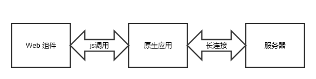

**图 1.1.1.1 Web 组件通过原生代理通信**

不过随着业务的发展，增加的 Web 组件也越来越多，最终整体的总览就变成下面这个样子：

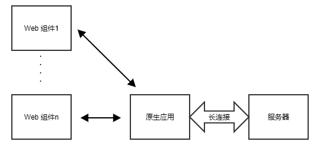

**图 1.1.1.2 Web 组件通信拓扑图**

长连接处在整个架构中心的位置，根据以往的经验看，有中心就会有依赖，仔细考虑当前这条长连接还是有很多弊端的，比如说：

1. 挤占原生进程的资源，原生程序为了维护Web组件通信的信道必须额外维护上下文。
2. 增加了程序开发调试的复杂度，因为依赖于原生端的 js 调用，所以 web 端的程序必须嵌入到原生应用中才能运行。

既然中心化是有缺陷的，那么最直接解决方案就是去中心化，鉴于长连接的维护成本较高，为了的解决方案中会采用短链接的架构：

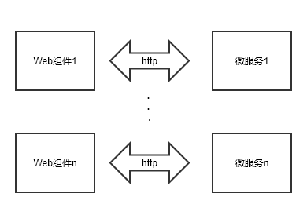

**图 1.1.1.3 Web 组件使用短连接**

从这里开始引入了微服务的概念，每个微服务负责独立的一个功能，与其对应的 Web 组件也相对独立。起初设计此架构是为了解决 PC 客户端的问题，后来此架构也延申到了移动 APP 端和网页端。

### 1.2 域名

**图 1.1.1.3** 中画了若干个 Web 组件，每个对应的都是不同的后端微服务，如果每次创建一个微服务都申请一个域名会对维护带来巨大的挑战。所以这个地方在设计的时候，所有的微服务采用同样一个域名，这里记这个域名为 micro-default。然后客户端在请求的时候，在请求路径前面添加微服务的标识，那么前置的域名解析 nginx 在做反代配置的时候，就可以做类似如下配置：

```nginx
server {
  listen 80;
  server_name micro-default;
  location /service_name_of_one_micro/ {
    rewrite ^/service_name_of_one_micro/(.*) /$1 break;
    proxy_pass http://the_addr_of_current_micro_service;
    proxy_cache my_cache;
    add_header X-Cache-Status $upstream_cache_status;
    proxy_set_header Host $http_host;
    proxy_set_header X-Real-IP $remote_addr;
    proxy_set_header X-Scheme $scheme;
  }
}
```

**代码 1.2.1**

## 2. 存在问题

### 2.1 智能 DNS 解析不均衡

#### 2.1.0 问题描述

端上访问服务器的默认域名是 micro-default 这个域名，它是做了动态 DNS 解析，会根据用户的运营商的 DNS 来决定解析到哪里去

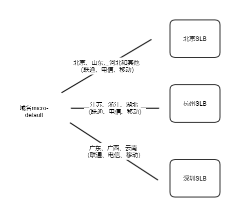

**图 2.1**

DNS 服务会根据用户上网设备用的 DNS 地址归属地来决定往哪调度，如果识别不出来就默认网北京节点调度，但是大部分用户的所用 DNS 地址的地址不被 DSN 服务所识别（比如说很多用户用的是 114 的DNS），所以就直接走默认值了。

这样导致的问题是，虽然我们有三个入口点，但是 80% 的流量集中到北京节点了，另外两个节点空闲，好在当前的 http 流量并不大，北京的入口点高峰期间占用的资源也很小。

#### 2.1.1 解决方案

##### 2.1.1.1 市面上的解决方案

[**D**NS **O**ver **h**ttps](https://zh.wikipedia.org/wiki/DNS_over_HTTPS)，使用 https 请求来代替传统 DNS 请求，根据请求者的出口 IP 可以精确的确定地理位置

举个例子，阿里 DNS，

https://dns.alidns.com/dns-query

https://223.5.5.5/dns-query
https://223.6.6.6/dns-query  
https://[2400:3200::1]/dns-query  
https://[2400:3200:baba::1]/dns-query  

不过这种技术需要用户自己单独在电脑上做配置，起码在电脑端当前解决方案实现起来不现实。

##### 2.1.1.2 自建解决方案

移动 APP 端或者 PC 客户端由于可以自行修改请求的 HTTP 数据包，所以可以在触发 http 请求之前，会尝试将域名发送一个调度接口，该接口能够返回后端配置过根据用户请求 IP 映射的服务器 IP，记为 `IPX`。如果 `IPX`存在，则使用这个 IP 去请求服务器端；否则就回退到传统的 DNS 解析模式。

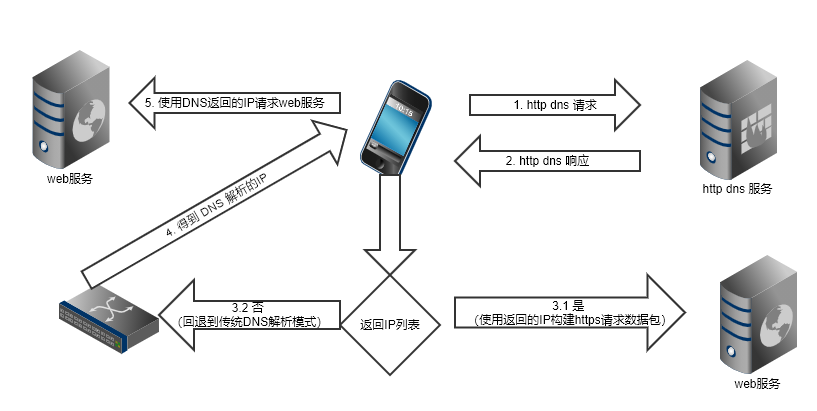

**图 2.1.1.2**

如果是浏览器端，则无法直接使用返回的 IP 地址来构建 https 请求，除非当前服务器的数字证书直接绑定在 IP 上，这种数字证书比较贵，一般公司不会购买。那么在上图第 2 步的时候，可以直接返回一个子域名来来解决，也就是说对于 **图2.1** 的每个 SLB 的 IP 都映射一个子域名。 

### 2.2 客户端缓存

#### 2.2.0 问题描述

同时留意到如果系统中存在集中跳转的情况出现，在短时间内就会有高并发查询接口的情况出现，下图是一个具体微服务请求日志的kibana统计，显示1ms发生了3000个并发请求，而这三千个请求都是同一个查询接口。

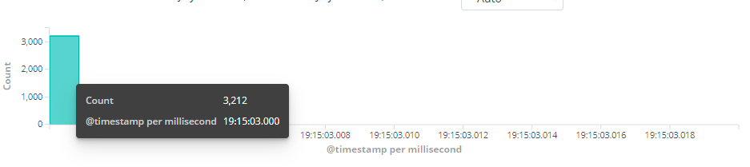

**图 2.2.0.1 1ms 3000请求**

#### 2.2.1 解决方案

##### 2.2.1.1 市面方案

在前置节点做文章（更多的称之为[边缘计算](https://baike.baidu.com/item/%E8%BE%B9%E7%BC%98%E8%AE%A1%E7%AE%97/9044985)），即使后端 http 服务是非静态资源，依然可以在前置节点做文章，将请求缓存在前置节点。


**图 2.2.1.1.1**

市面上常见的产品有[阿里云DCDN](https://www.aliyun.com/product/dcdn?spm=5176.19720258.J_8058803260.60.e9392c4a3ANYHn) [nginx plus](https://www.nginx.com/products/nginx/) [openresty edge](https://openresty.com/en/edge/)

##### 2.2.1.2 自建解决方案

跟市面上的服务器的处理原理一样，只不过我们只关心缓存处理，具体缓存协商流程分析

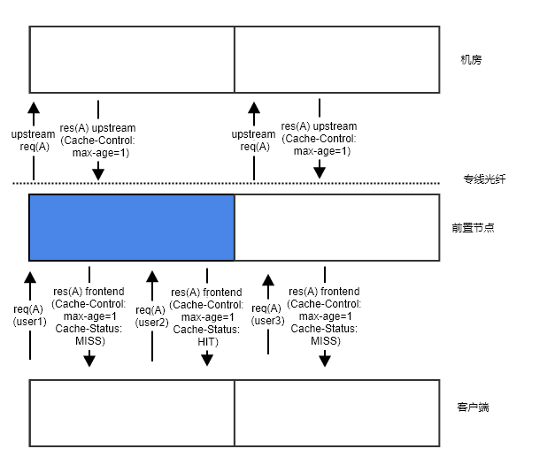

可以看出来，前置节点像一个漏洞，将本来请求到机房的流量给拦截了一部分，流量拦截量的多少，就取决于机房里面的服务设置的缓存时间的长短（记为 **CACHE-A**）。同时前置节点和客户端之间还有缓存时长约定(记为 **CACHE-B**)，这个约定可以规范客户端的请求间隔时长，让客户端不要在短时间内发送过多的请求到前置节点。理论上讲，客户端端最终拿到数据的滞后时间为 **max(CACHE-A, CACHE-B)**。

## 3. 性能问题排查

在 nginx 的访问日志中可以配置如下几个字段：request_time upstream_connect_time upstream_header_time upstream_response_time，这几个字段的意义如下图所示：

> 参考配置代码
>
> ```nginx
>   log_format json '{"@timestamp":"$time_iso8601",'
>             '"server_addr":"$server_addr",'
>             '"client":"$remote_addr",'
>             '"method":"$request_method",'
>             '"request":"$request",'
>             '"request_length":$request_length,'
>             '"status":$status,'
>             '"bytes_sent":$bytes_sent,'
>             '"body_bytes_sent":$body_bytes_sent,'
>             '"http_referer":"$http_referer",'
>             '"http_user_agent":"$http_user_agent",'
>             '"upstream_addr":"$upstream_addr",'
>             '"upstream_status":"$upstream_status",'
>             '"request_time":$request_time,'
>             '"upstream_response_time":"$upstream_response_time",'
>             '"upstream_connect_time":"$upstream_connect_time",'
>             '"upstream_header_time":"$upstream_header_time",'
>             '"remote_user":"$remote_user",'
>             '"http_host":"$host",'
>             '"url":"$uri",'
>             '"xff":"$http_x_forwarded_for"}';
>   log_format main;
> ```
>
> 

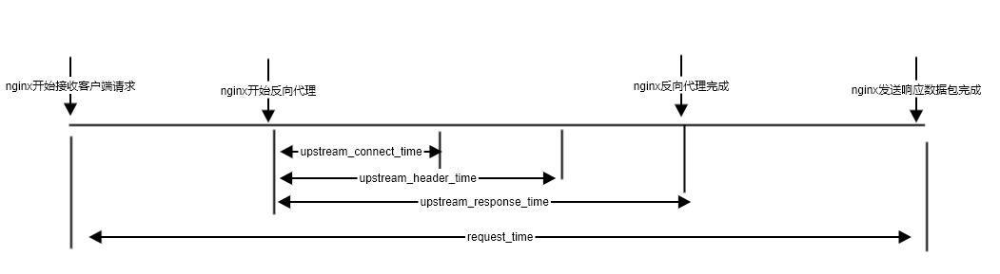

**图 4.1**

典型问题分析：

情景1

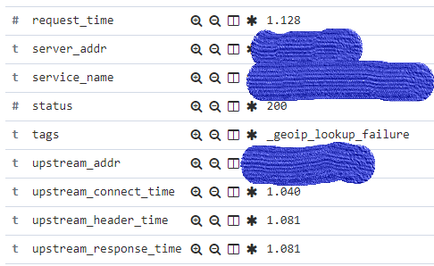

**图 4.2**

upstream_connect_time ≈ upstream_header_time ≈ upstream_response_time ≈ request_time

时间耗费在跟后端服务器建连上，说明专线带宽不稳定（小概率），或者单位时间内并发过大（大概率，目前反向代理使用的http 1.0，容易出现这种问题）

情景二

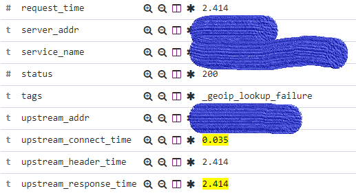

**图 4.3**

upstream_connect_time << upstream_header_time ≈ upstream_response_time

时间耗费在后端服务处理上

情景三

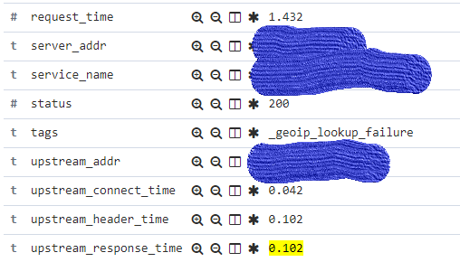

**图 4.4**

upstream_connect_time ≈ upstream_header_time ≈ upstream_response_time << request_time

时间耗费在客户端数据读写上或者 客户端和 nginx 建连上，由于目前nginx版本比较低，nginx建连时间暂时取不到，但是这种情况出现的概率很低，大概率是耗费在读写客户端数据上。

> 严格意义讲，request_time 不是客户端请求的真正时间，从客户端测观察的时间要比这个时间稍大。极端情况下会有大的偏差，因为客户端网卡满载情况下，服务器端网络层写入的数据有可能会被客户端丢包，继而会引发重传，耗费大量的时间，这部分时间在服务器端是没法记录的。


