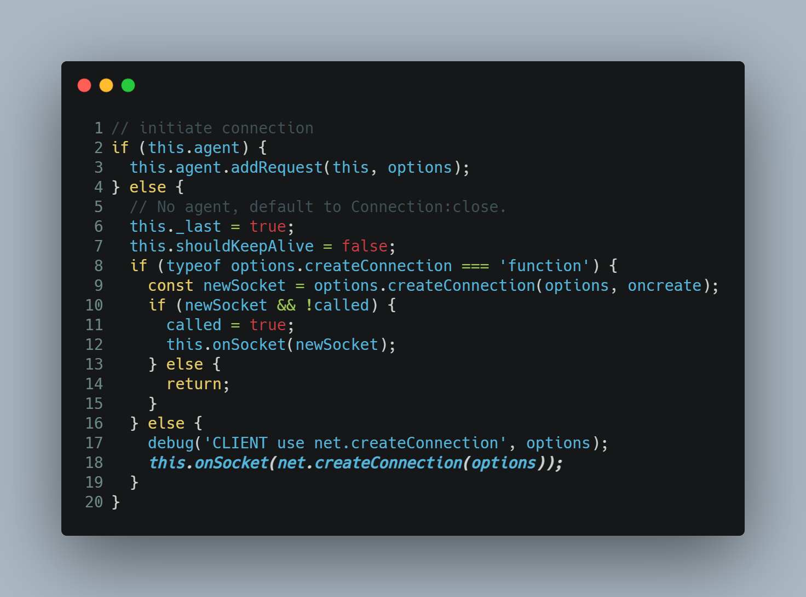
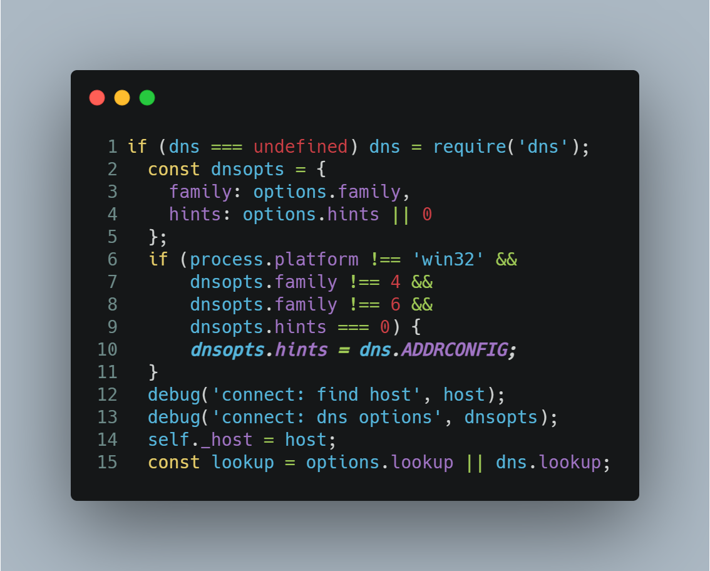
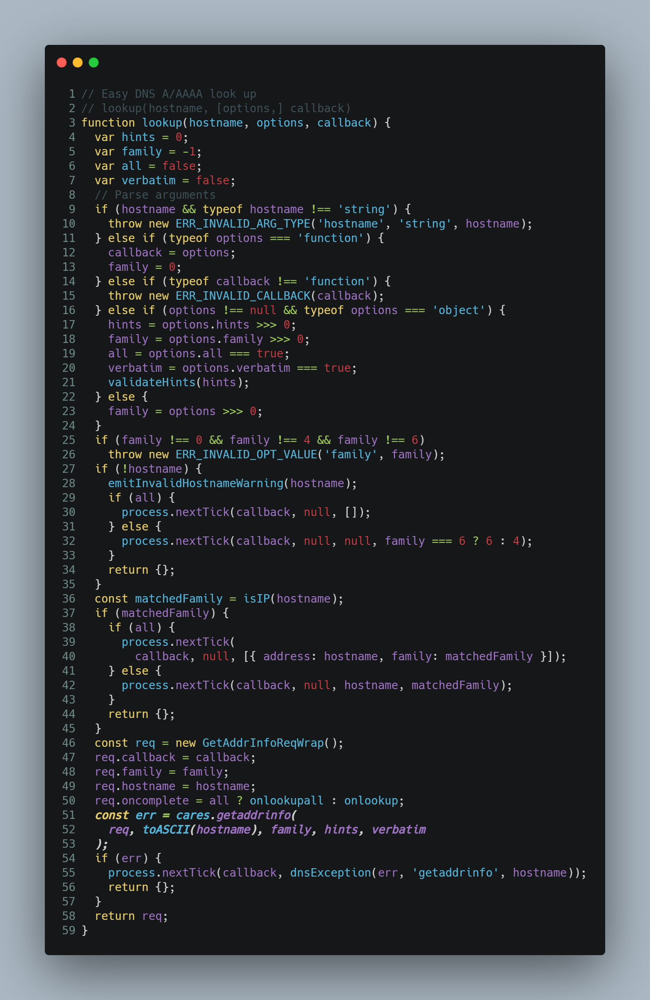
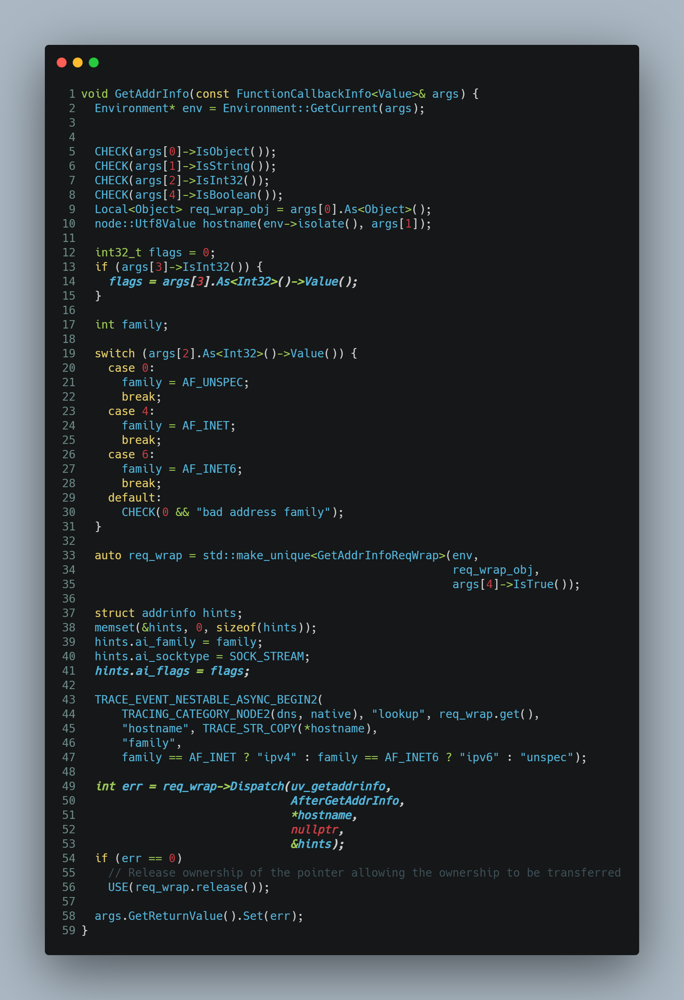
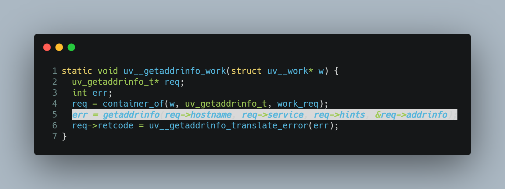

事情的起因是这样的，公司使用自建 dns 服务器，但是有一个致命缺陷，不支持 ipv6 格式的地址解析，而 node 的 DNS 解析默认是同时请求 v4 和 v6 的地址的，这样会导致偶尔在解析  v6 地址的时候出现超时。

> 本文链接地址 https://blog.whyun.com/posts/request-dns/the-problem-of-dns-timeout-on-request-package/index.html ，转载请注明出处。

我们的程序中是使用的 [request](https://github.com/request/request) 这个包，查看了一下官方文档，请求 options 中并没有涉及跟 DNS 有关的配置，于是乎求教运维同事。运维同事告诉我在 docker run 的时候加参数 `--sysctl net.ipv6.conf.all.disable_ipv6=1`，试用了一下，并且写出来如下测试代码：

```javascript
const dns = require('dns');
const domain = process.argv[2] || 'baidu.com';
const begin = Date.now();
dns.lookup(domain,function(err ,address , family) {
    console.log('耗时',Date.now() - begin, err ,address , family);
});
```

**代码 1.1 DNS 查询测试代码**

运行 **代码 1.1** ，同时使用命令 `tcpdump -i eth0 -n -s 500 port domain` 来抓取 DNS 解析的数据包：

```
20:47:28.917563 IP 10.6.13.67.38050 > 10.7.11.219.domain: 40621+ A? baidu.com. (27)
20:47:28.917582 IP 10.6.13.67.38050 > 10.7.11.219.domain: 32393+ AAAA? baidu.com. (27)
20:47:28.921061 IP 10.7.11.219.domain > 10.6.13.67.38050: 40621 2/0/0 A 220.181.38.148, A 39.156.69.79 (59)
20:47:28.921114 IP 10.7.11.219.domain > 10.6.13.67.38050: 32393 0/1/0 (70)
```

从输出来看依然会请求 ipv6 的地址解析，所以当时我的判断是运维的配置是不生效的。

后来又有了些空闲的时间，所以研究了一下官方文档，看看是否有参数可以控制 http 请求的 DNS 协议版本，没有想到还真有，[http.request](https://nodejs.org/dist/latest-v10.x/docs/api/http.html#http_http_request_options_callback) 的 options 中可以设置 family 参数，可选值为 `4` `6`, 即 ipv4 或者 ipv6，如果不指定这个参数，将同时使用 ipv4 和 ipv6。按理来说看到这里，我就应该死心了，如果不传这个参数，肯定会同时做 ipv4 和 ipv6 的地址解析，但是我还是抱着试试看的态度写下了如下测试代码：

```javascript
var domain = process.argv[2] || 'baidu.com';
require('http').request('http://' + domain,function(res) {
    console.log(`STATUS: ${res.statusCode}`);
  console.log(`HEADERS: ${JSON.stringify(res.headers)}`);
  res.setEncoding('utf8');
  res.on('data', (chunk) => {
    //console.log(`BODY: ${chunk}`);
  });
  res.on('end', () => {
    console.log('No more data in response.');
  });
}).end();
```
**代码 1.2 http 请求测试**

没有想到 **代码 1.2** 执行完成后竟然只做了 ipv4 的解析：

```
21:01:06.593429 IP 10.6.12.158.48479 > 10.7.11.219.domain: 10352+ A? baidu.com. (27)
21:01:06.596978 IP 10.7.11.219.domain > 10.6.12.158.48479: 10352 2/0/0 A 39.156.69.79, A 220.181.38.148 (59)
```

这就很神奇了，node 的 http 的代码封装中肯定做了什么！带着这个疑问，我阅读了 node 的源码，首先看 ClientRequest 的初始化代码中，连接初始化部分：



**代码 1.3 [ClientRequest 类的连接初始化](https://sourcegraph.com/github.com/nodejs/node/-/blob/lib/_http_client.js#L274)**

http.request 没有加任何参数的情况，默认走到 `this.onSocket(net.createConnection(options));` 这句话，然后看 net 包的代码，其中一端跟 DNS 相关的代码：



**代码 1.4 [net 包中 DNS 查询参数代码](https://sourcegraph.com/github.com/nodejs/node/-/blob/lib/net.js#L1010)**

然后我们再看 lookup 函数的源码：




**代码 1.5 [lookup 函数源码](https://sourcegraph.com/github.com/nodejs/node/-/blob/lib/dns.js#L88)**

通过代码 1.5 发现最终 DNS 查询是要调用 C++ 绑定类的，于是我又查看了 C++ 的代码：



**代码 1.6 [C++ 中 DNS 的查询代码](https://sourcegraph.com/github.com/nodejs/node/-/blob/src/cares_wrap.cc#L1940)**

注意 **代码 1.5** 中的 family hints 最终会分别转化为 结构体变量 struct addrinfo hints 中的 ai_family 和 ai_flags。

最终这个结构体 hints 会层层传递到 libuv 中：




**代码 1.7 [libuv 中的 dns 查询函数代码](https://sourcegraph.com/github.com/nodejs/node@c5f5f84a33967862036c7d87f4bbde6a59d3820a/-/blob/deps/uv/src/unix/getaddrinfo.c#L101)**

注意到我们在 **代码 1.4** 中的 hints 参数，最终会作为 req->hints->ai_flags 参数，最终我在 man7 文档上找到了 [AI_ADDRCONFIG](http://man7.org/linux/man-pages/man3/getaddrinfo.3.html)  的这个参数的说明：

```
If hints.ai_flags includes the AI_ADDRCONFIG flag, then IPv4
addresses are returned in the list pointed to by res only if the
local system has at least one IPv4 address configured, and IPv6
addresses are returned only if the local system has at least one IPv6
address configured.  The loopback address is not considered for this
case as valid as a configured address.  This flag is useful on, for
example, IPv4-only systems, to ensure that getaddrinfo() does not
return IPv6 socket addresses that would always fail in connect(2) or
bind(2).
```

大体意思是说，系统配置了 ipv4 才返回 ipv4的地址，系统配置了 ipv6 才返回 ipv6 的地址，而 docker 的启动参数 `--sysctl net.ipv6.conf.all.disable_ipv6=1` 等同于系统只支持 ipv4 的声明，所以操作系统函数 `getaddrinfo` 就只返回 ipv4 的地址。

重新验证这个问题，将代码 1.1 做改造：

```javascript
const dns = require('dns');
const domain = process.argv[2] || 'baidu.com';
const begin = Date.now();
dns.lookup(domain,{hints:32},function(err ,address , family) {
    console.log('耗时',Date.now() - begin, err ,address , family);
});
```

**代码 1.8 使用 ADDRCONFIG 参数做 DNS 查询**

> 这里面之所以取值的 hints:32，是因为 `AI_ADDRCONFIG` 的值为32。通过设置环境变量 NODE_DEBUG=net 后启动 **代码1.2** ，会发现 `debug('connect: dns options', dnsopts);` 打印的 hints 值为 32。

重新运行，发现果然只查询了 ipv4 的地址。

到此为止，其实可以算是圆满收官了，但是对于 request 包还是不死心，心想如果当前开源源码不支持，是否可以做一个 pull request  呢，于是我看了一下他们的官方源码，结果就发现了新大陆：

```javascript
  var reqOptions = copy(self)
  delete reqOptions.auth

  debug('make request', self.uri.href)

  // node v6.8.0 now supports a `timeout` value in `http.request()`, but we
  // should delete it for now since we handle timeouts manually for better
  // consistency with node versions before v6.8.0
  delete reqOptions.timeout

  try {
    self.req = self.httpModule.request(reqOptions)
  } catch (err) {
    self.emit('error', err)
    return
  }

```

**代码 1.9 request 源码片段**

`self.httpModule.request(reqOptions)` 等同于 `http.request(reqOptions)` 或者 `https.request(reqOptions)`，也就是说 http 模块的所有参数其实在 request 上也是适用的，但是 request 的官方文档却没有指出！

最圆满的方案出炉了，在调用 request 函数的时候，指定 family 为 4，也可以通过 node 代码层面屏蔽 ipv6 解析。不过鉴于启动 docker 时已经添加 `sysctl` 参数，即使 node 不指定使用  ipv4，请求 http 也会只返回 ipv4 的地址。