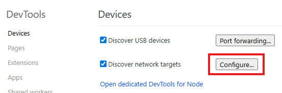
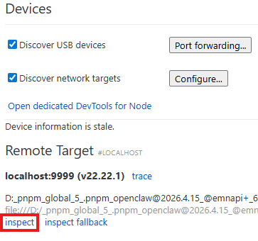
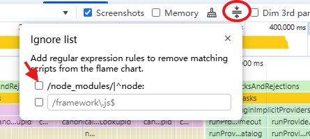
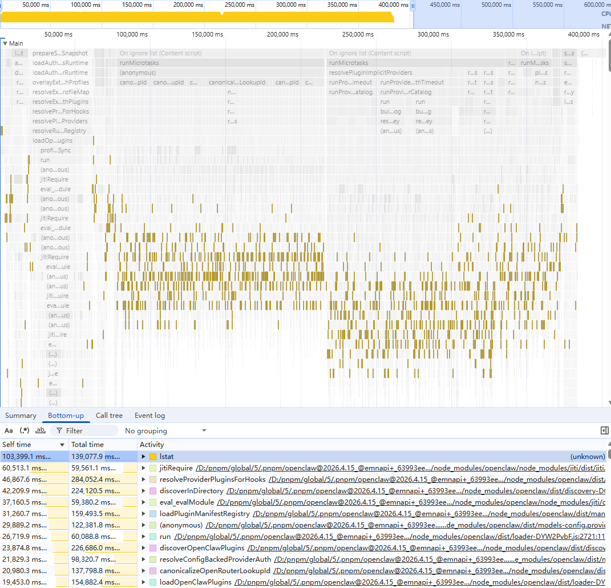
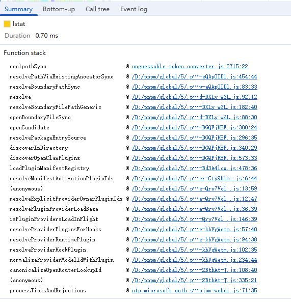
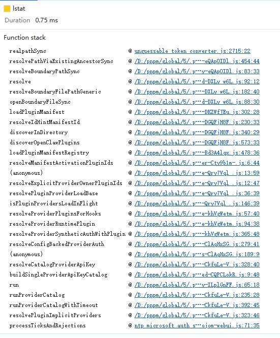

2026 年最火的 AI 应用，相信大家都会选择小龙虾，他真正的拉低的智能体的使用门槛，使得 AI 工具从旧时王谢堂前燕，飞入了寻常百姓家。但是我个人在使用过程中，确发现了其还是有很多坑的，首先就是启动速度慢如蜗牛。

```
🦞 OpenClaw 2026.4.15 (041266a) — I read logs so you can keep pretending you don't have to.

│
◇
10:12:53 [gateway] loading configuration…
10:12:53 [gateway] resolving authentication…
10:12:53 [gateway] starting...
10:13:05 (node:15732) [DEP0040] DeprecationWarning: The `punycode` module is deprecated. Please use a userland alternative instead.
(Use `node --trace-deprecation ...` to show where the warning was created)
10:14:01 [gateway] starting HTTP server...
10:14:01 [canvas] host mounted at http://127.0.0.1:18789/__openclaw__/canvas/ (root C:\Users\yunnysunny\.openclaw\canvas)
10:14:01 [health-monitor] started (interval: 300s, startup-grace: 60s, channel-connect-grace: 120s)
10:14:02 [gateway] agent model: minimax/MiniMax-M2.7
10:14:02 [gateway] ready (5 plugins: acpx, browser, device-pair, phone-control, talk-voice; 69.1s)
10:14:02 [gateway] log file: C:\Users\yunnysunny\AppData\Local\Temp\openclaw\openclaw-2026-04-22.log
10:14:04 [gateway] starting channels and sidecars...
10:14:05 [hooks] loaded 4 internal hook handlers
10:21:44 [plugins] embedded acpx runtime backend registered (cwd: C:\Users\yunnysunny\.openclaw\workspace)
10:21:44 [browser/server] Browser control listening on http://127.0.0.1:18791/ (auth=token)
10:21:51 [heartbeat] started
10:21:51 [plugins] embedded acpx runtime backend ready
```

**日志 1.0 openclaw 启动日志**

从上述日志中可以看出执行完 `[hooks] loaded 4 internal hook handlers` 和 `[plugins] embedded acpx runtime backend registered (cwd: C:\Users\yunnysunny\.openclaw\workspace)` 直接隔了几分钟的时间，真是等的黄花菜都凉了。虽然我的电脑是 8 代 i5，老了点，但是官方教程中可以说树莓派都能支持，我这笔记本怎么也是树莓派强多了。

在启动过程中顺便看了一眼 CPU ，发现单个核心被跑满了，那就先生成一个 CPU Profiler 看看火焰图，到底是哪块代码引起的。

找到 openclaw 的 gateway 的启动文件，在我的电脑上位于 `D:\pnpm\global\5\.pnpm\openclaw@2026.4.15_@emnapi+_63993eeb80c075f86cc91107e81b8ada\node_modules\openclaw\dist\index.js`，那我们通过如下命令即可启动 Node 的调试模式：

```shell
D:\node\node.exe --inspect=9999  D:\pnpm\global\5\.pnpm\openclaw@2026.4.15_@emnapi+_63993eeb80c075f86cc91107e81b8ada\node_modules\openclaw\dist\index.js gateway --port 18789
```

**命令 1.0 调试模式启动 gateway**

在运行上述命令之前，需要先打开 Chrome，在地址中输入 `chrome://inspect` 回车，打开远程调试配置界面，在上面点击按钮 `Configure...` ，即可打开远程调试地址配置窗口，在其新增一条 `localhost:9999` 即可




**图 1.0 调试端口配置**

接着启动命令，Chrome 会自动检测到可以调试 Node 进程上线，点击 inspect 链接即可打开远程调试控制台。



**图 1.1 远程调试可用**

远程调试控制台和我们平常用的浏览器网页控制台是一样的，在 Performance 面板点击 Record 按钮即可录制 CPU Profiler，在启动完成后手动结束录制即可。

结束录制后，我们得到了想要的 CPU Profiler 对应的火焰图，注意要将 node 代码 从忽略列表中移除，否则看不到完整堆栈。



**图 1.2 移除 node 代码的忽略选项**

> 由于生成的 CPU Profiler 比较大，在实时调试时，电脑性能不足的话，会比较卡，可以将其下载下载下来，然后再一个不处于调试状态的 Chrome 内核的浏览器中导入来查看。

点击下侧的 Bottom-up 标签页，可以看到 lstat 这个函数调用最频繁。



**图 1.3 lstat 调用占大头**

从火焰图上通过点选带有 lstat 函数的调用块，可以找到下面两个堆栈：



**图 1.4 耗时多的堆栈1**



**图 1.5 耗时多的堆栈 2**

我对照者源码看了一下，这两个堆栈中绝大多数代码都是同步调用的，也就是说在主线程上调用，我说启动的时候咋吃满一整颗 CPU 核心，原来症状在这里。话说写个异步版本就是换换语法而已，但是带来的性能提升却是杠杠的，不知道 openclaw 团队是在想什么，现在文件 IO 都堵在了主线程上，不慢才怪。

由于牵扯的代码过多，将其全部改成异步版本，代码量巨大，所以我考虑先用 Cursor 改一版。不过那就是下一期的文章内容了。

未完待续……


