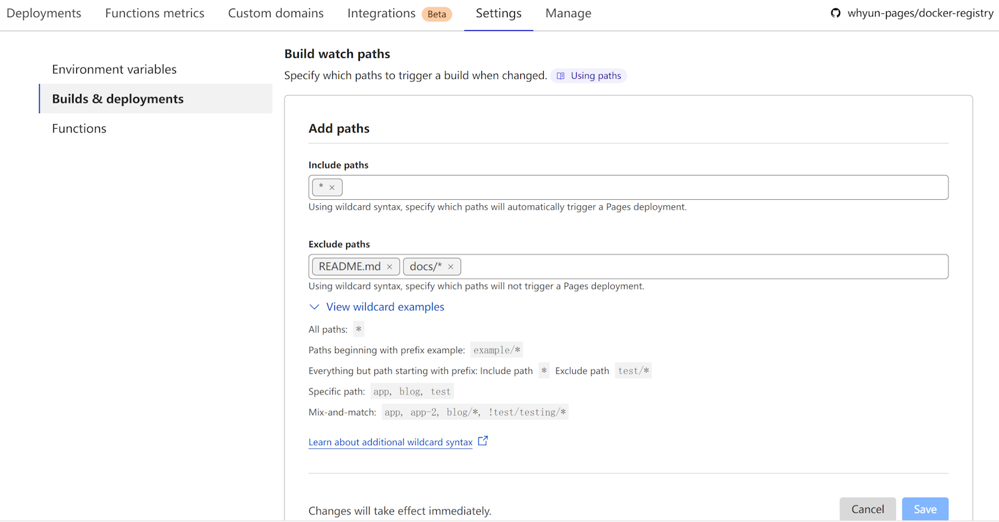

在之前的文章中，谈到了笔者的博客被攻击，在尝试了各种国内 CDN 解决方案后都无解，最后靠 cloudflare 提供的免费 pages 服务完美解决。从这篇文章起，笔者将开始深入探究 pages 的使用方法，让更多的人能够用上这种惠民的服务。作为开篇之作，本文重点关注 cloudflare pages 的项目初始化和部署相关的内容。
对于 cloudflare pages 来说，其提供了两方面的内容，即可托管静态页面和可以通过其 Functions 功能来提供 Serverless 服务，所以总体来说  pages 产品实现了 静态 CDN + Serverless 的全栈开发能力。
## 1. 可以用来干啥
前面提到了 pages 相当于一个 静态 CDN + Serverless 的组合套件，那么对于大多数人来吸引力最大的就是其静态 CDN 功能，因为对于用户来说，这部分功能是完全免费的，不管你的访问量流量有多大，统统免费。
其次就是其 Functions 功能，对于免费用户来说每天 10万次请求，每分钟一千次峰值请求，对于个人用户甚至绝大多数小公司来说都是够用的。Functions 可以解析 HTTP 请求参数，使用连接到的数据库或者缓存动态处理数据，也可以在请求内部触发请求第三方 HTTP 接口。所以说用它来做简单的数据增删改查或者做一个反向代理服务器是完全够用的。特别是后者，很多情况下，我们要使用的第三方接口在国外，访问速度比较慢，用 cloudfare 做一层反代，效果非常好。
## 2. 不能做什么
单纯的托管静态页功能 pages 已经做得很完美了，这里主要探讨器 Functions 功能的不足。Functions 其实是 cloudflare Workers 在 pages 产品中的复用，所以我们这里直接聊 Workers 即可。cloudflare 在开发 Workers 产品，底层使用了 V8 引擎，上层封装了一些自定义的 API 以提供 serverless 服务。既然都是运行在后端的 JavaScript，那么你肯定会问，这跟 Node 有啥区别。Workers 确实提供了对于 Node 进行了兼容，不过不要高兴的过早，它只提供了个别模块的支持，大部分模块是不支持的，即使是支持的个别模块，每个模块内部的函数也不是所有都支持的。这样就导致，你随便从 npmjs 上找一个包，这个包基本上是没法被 Workers 调用的。所以你想将旧有的线上项目迁移到 Workers 是几乎不可能的，除非你的项目功能很简单，这样你可以通过 Worker 提供的 API 重新写一遍。
其次，Worker 有一项收费标准是 CPU 执行时间，比如说对于免费用户来说单次请求最多只分配 5ms 的CPU 时间，5ms CPU 时间用完，请求还没有处理完，就直接丢弃掉。注意这里的 CPU 时间仅仅是 JavaScript 线程执行时间，不包含 IO 处理的事件，比如一个请求内部有操作数据库的操作，即使数据库查询用了 10ms，那么这 10 ms 也不会被统计到 CPU 时间损耗上。对于开发者来说，可以理解每次请求 Workers 都会单独分配一个线程来进行处理，这个跟我们 Node 中的单线程的概念还是不一样。Node 中进程启动就会创建一个主线程，这个主线程一直常驻内存；但是 Workers 的线程在请求处理完成之后，就被收回了，这种机制可以方便的让云厂商对 CPU 执行时间进行计费，但是他们这样做后，你就失去了写常驻内存的代码的能力。这会导致我们会面临很多不便，比如说虽然 Workers 提供了 Socket API 让你自己编写驱动代码，理论上可以连接任意基于 TCP 协议的第三方服务，但是由于 Workers 不能常驻内存的特性，这些 TCP 连接只能每次请求的时候重新建立，如果 Workers 的请求并发数过猛，第三方服务的 TCP 句柄数会存在被耗尽的可能。
> 使用云原生的数据库（例如 [Cloudflare D1](https://developers.cloudflare.com/d1/) [Turso — SQLite for Production](https://turso.tech/) [Upstash](https://upstash.com/)），你可以不用担心句柄数的问题，但是如果你的数据之前已经存在传统数据库中，还得考虑迁移的成本问题。

## 3. 创建一个 Pages 项目
上面提到了 Pages 的优缺点，现在我们来实践一下，讲解如何将 Pages 利用起来。

### 3.1 对接 github 或者 gitlab 的项目
这个是笔者最推荐的方式，虽然说其只支持对接 github 和 gitlab 项目，但是为了能免费使用 Pages 的功能，将原有不在这两个网站上托管的项目迁移过去，也未尝不可，毕竟现在两个网站都不限制私有仓库的数量。

唯一让人感觉到不爽的是，我的 github 项目有些多，它没有提供筛选功能，我只能一页页自己翻。

**图 3.1.1**
选中项目后，就会打开项目部署配置界面，这里你可以配置项目打包命令，如果你的项目是用前端框架开发的化，Pages 还贴心的把常用前端框架的构建命令收集起来，你只需要下拉框选中之后就会把默认构建命令填充到表单中：

**图 3.1.2**
当然你没有使用任何前端框架的话，可以直接选择 None，然后根据需要填写自己的构建命令。

使用 git 模式，有一个副作用，就是你每次做 git push 的时候都会触发部署，即使你当前提交部署的内容仅仅是修改了一下 README.md 文件。cloudflare 官方已经考虑到了这个问题，你在 **Settings** 选项卡中，打开 **Builds & deployments** 菜单，找到 **Build watch paths** 表单，在输入框 **Exclude paths** 中输入你想忽略的文件即可，输入项支持路径前缀，比如说下图中的 `docs/*` 将忽略 `docs` 文件夹及其所有位于其下面的文件。


**图 3.1.3**
### 3. 2 直接上传本地文件
如果你临时想做一个静态演示网站，又或者你由于某些原因不想将项目托管在 github 或者 gitlab 上，可以直接把本地的静态文件上传到 Pages 中。
> github 在大陆访问性一般，可能有些人会更愿意选择 gitlab，但是如今 gitlab 官方已经关闭中国大陆和港澳地区的新用户注册通道（会被跳转到[极狐 GitLab](https://gitlab.cn/saasmigration/)，此产品仅允许试用 90 天）。虽然你可以选择使用 bitbucket 等第三方注册通道绕开这个限制，但是新注册的用户如果想使用其 gitalb ci 功能，需要验证信用卡和手机号，这两者都不支持中国的卡号，不过 gitlab 的其他功能不受影响。

Pages 支持上传文件夹和 zip 文件两种格式，推荐使用 zip 文件，这样上传的速度会快些。
### 3.3 使用命令行工具
> 由于命令行工具不太稳定，具体原因下面会说，不推荐大家试用。
#### 3.3.1 登录认证
首先你需要全局安装 wrangler 命令 `npm install wrangler -g`，然后执行 `wrangler login` 进行登录认证。注意只有认证完成才能进行项目创建等操作。同时需要注意到登录认证会打开浏览器进行 OAuth2 认证，但是认证成功后回调到 welcome.developers.workers.dev 这个域名，但是这个域名对应的服务器只有国外节点，在国内有可能打不开，从而导致认证失败。
#### 3.3.2 创建项目
接着是创建项目命令，`wrangler pages project create 你的项目名称` 。注意这会创建一个全新项目，不能和之前已经创建的重名。
如果上一步 login 操作没有完成的话，创建的时候会直接报错：
```
✘ [ERROR] A request to the Cloudflare API (/accounts/你的cloudflare用户id /pages/projects) failed.

  Could not route to /accounts/你的cloudflare用户id /pages/projects, perhaps your object
  No route for that URI [code: 7000]

  If you think this is a bug, please open an issue at:
  https://github.com/cloudflare/workers-sdk/issues/new/choose
```
#### 3.3.3 部署项目
##### 3.3.3.1 项目中不包含 wrangler.toml 文件
通过命令 `wrangler pages deploy 静态页所在路径` 即可触发部署动作，运行 deploy 命令的时候，wrangler 会首先查看运行命令行所在路径是否有 wrangler.toml，如果 wrangler.toml 存在，就读取其 name 属性来决定将文件部署到哪个目录中，否则会提示你手动创建一个新的Pages项目，或者选择一个已经存在的 Pages 项目：

**图 3.3.3.1.2 创建或者选择项目**

**图 3.3.3.1.1 项目选择列表**
##### 3.3.3.2 项目中包含 wrangler.toml
如果在项目根目录中包含了 wrangler.toml 文件，并且配置了如下属性：
```toml
name = "项目名称"
pages_build_output_dir = "静态文件所在目录"
```
则直接运行 `wrangler pages deploy` 即可，它会自动读取 `静态文件所在目录` 下的所有文件并上传到创建好的 `项目名称` 中去。

## 4. 项目代码初始化
### 4.1 使用模板代码
cloudflare 官方提供了脚手架命令 `npm create cloudflare` 来快速在本地生成一个模板项目，但是其对应的 create-cloudflare 包有写小 bug ，导致用不了，所以推荐直接将 github 项目[workers-sdk](https://github.com/cloudflare/workers-sdk)下载到本地来用，用到哪个模板直接拷贝出来。模板都放到了项目的 templates 目录下：

**图 4.1.1 官方给出的 pages 相关的模板**
### 4.2 自己从头开始编写代码

由于 Pages 说白了默认就是一个静态项目，所以是没有任何约束的，写完代码后通过第 3 所述的方法部署即可， 没啥需要特殊配置的。
但是如果你想使用 Functions 功能实现后端代码的逻辑，所以为了方便你编写代码，一般会选择使用 typescript，这时候你需要安装 `@cloudflare/workers-types` 依赖。
同时你需要在 tsconfig.json 中设置 types 属性：
```json
{
  "include": ["src/**/*"],
  "exclude": ["functions/**/*"],
  "compilerOptions": {
    "target": "ESNext",
    "module": "ESNext",
    "moduleResolution": "Bundler",
    "outDir": "./functions",
    "strict": true,
    "skipLibCheck": true,
    "lib": [
      "ESNext"
    ],
    "types": [
        "@cloudflare/workers-types"
    ]
  },
}
```
**代码 4.2.1**

注意上述代码中我们严格要求 ts 编译生成的 js 使用 ES Module 语法，因为 Functions 功能，也就是 Cloudflare Workers 不支持 CJS 语法。
> 项目使用的 typescript 版本不同，则 `moduleResolution` 的值不同，在 5.x 版本中你需要使用 `Bundler`，而在 4.x 中你需要使用 `node` 。

同时 Workers 只支持 JavaScript 语法，不支持 typescript 语法，所以我们需要将 ts 代码编译成 js 代码，才能在 Workers 中执行。**代码 4.2.1** 中是将 src 目录下的 ts 代码编译成 functions 目录下 js 。
functions 文件夹是 Pages 特有的目录格式，用于存放后端路由代码。
拿我的项目 [whyun-pages/fawave (github.com)](https://github.com/whyun-pages/fawave) 举例：

**图 4.2.1**
现在运行 tsc 后，经会将 src/oauth2/callback.ts 编译到 functions/oauth2/callback.js ，这样部署到 Pages 后，访问的路径就是 https://你的cloudflare域名/oauth2/callback 。
> 这里之所以你在 src 目录下放一个 utils.ts 是为了保证生成的 js 代码保持原有文件夹路径。

callback.ts 中你可以接收请求的 querystring 参数或者 body 参数进行处理，这里仅仅给出读取 querystring 参数，然后返回给请求者的例子：
```typescript
import { urlParams } from "../utils";

export const onRequest: PagesFunction = async (context) => {
    const params = urlParams(context.request.url);
    return new Response(params.code);
}
```
**代码 4.2.2**
> 如果想读取 HTTP 请求 body 的内容，可以参见官方文档 [Request · Cloudflare Workers docs](https://developers.cloudflare.com/workers/runtime-apis/request/#instance-methods)。它提供了 `formData` `json` 等函数方便开发者使用。

以上就是初始化 Pages 项目的全部内容了，下一篇内容预计会将 Pages 的请求路由的编写教程。