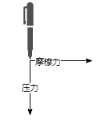
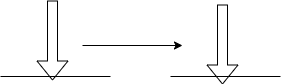
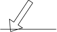
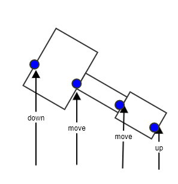
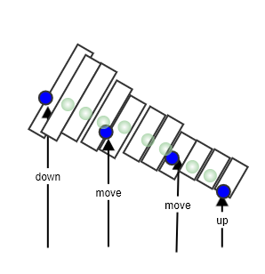

## 1. 背景分析

在前公司做的最后一个项目是一个智能笔项目，按理来说这个项目跟自己已经没有关系了。写这篇文章的目的，更多的是对于智能硬件合作商技术方案的反思。

跟我们公司合作的是一家称之为某千里的智能笔硬件厂商，他们提供一种点读笔的技术解决方案。具体描述一下，就是在一张打印纸上先铺满“码点”，这种码点肉眼不可见，但是点阵笔可以读取。然后在同样一张纸上再印刷上书籍内容。用户使用点阵笔在这张特定的纸上作答时，笔上的感光元件可以读取纸上的码点，来确定当前书写的笔尖在纸上划过的坐标位置。

**图 1.0**

点阵笔之所以能够正确的识别书写坐标，还依赖于每个码点在一张纸上来说，形状是唯一的。将一个码点放大几十倍后，可以看到每个码点都是一个类似二维码的结构，而每个二维码对应的值都不同。

在书写过程中点阵笔的数据会通过蓝牙传送到一个安卓设备上，然后安卓设备再通过网络传输，发送到后端服务器，后端服务器根据传送过来的数据，可以做笔迹还原。

**图 1.1**

最终后端从智能笔中得到的数据中含有数据：坐标点、压感值、事件类型，其中事件类型分为：DOWN MOVE UP 三种类型。如果不考虑压感的话，对于笔迹的还原，还是比较简单的。将一组 DOWN MOVE UP 的坐标点进行连线即可。

**图 1.2**

但是如果想还原的更精确一些，比如说增加笔锋效果，就必须得将压感值也考虑在内。简单处理的画，就是将压感等比例缓存为线宽。

**图1.3** 

通过上图可以看出，使用了压感之后，产生的图片反而更模糊了。由于当前书写用的点阵笔，从外观上看就是一只普通的黑色签字笔，通过笔尖和纸张接触产生油墨。我们最终所见的书写的笔画粗细，并不仅仅是增减书写的“压力”来实现的。笔尖可以书写油墨，更多的油墨和纸张接触后，笔尖和纸张的摩檫力减小，显然这时候书写者不必再用更多的力就能让笔画显示在纸张上。套用物理学的理论来分析一下这个事情，对于笔进行受力分析，书写时可以分为垂直方向的压力和水平方向的摩檫力：

**图 1.4**

增加压力时，笔尖和纸张的接触面积变大，线宽确实能增加，

**图 1.5**

但是我们平常用笔的习惯，并不是百分之百垂直下笔的，而是笔和纸张之间有一个倾斜角，类似于如下样式

**图 1.6**

笔倾斜时，笔尖和纸张的接触面积也会变大，同样从视觉上看，线宽也增加了。

同时不可忽略的一个因素是，使用签字笔的时候，油墨量随着书写过程，会分泌更多，会让笔尖更“油”，转化为物理术语的话，也就是摩檫力减小了，那么你可以花费更小的压力，就可以得到同样粗的笔画。

通过以上分析，可以得出单纯使用垂直方向的压力根本就不能和线宽成正比。有可能在数据采集过程中，视觉上线宽正常的笔画，压力值却比较小，小到还原出来后看不清楚，也就会出现 **图 1.3** 的情况，还原出来会模糊。

既然不能将当前的压力值简单跟线宽建立正比关系来还原，那么有没有解决方案呢？答案就是做插值。既然现在还原出来的线条是不平滑的，那就通过补点来让其变得平滑。

**图 1.7**

图 1.7 中中间的一个线段，明显就属于过渡不平滑的现象，解决方案就是在当中补充更多的点，让线条更平滑，如图 1.8 所示，绿色点属于补点内容。

**图 1.8**

其实，算法再好，也仅仅是模拟，由于若干不可控因素，笔尖的大小、油墨出油量的大小，都会对于真实线条的粗细产生影响。如果此智能笔再增加一个光感传感器，能够直接拾取书写的笔墨的颜色，那么数据来的会更直接些。

**图 1.9**

上图中蓝色部分代表油墨内容，增加一个传感器能够拾取油墨内容和点阵坐标做合成是一个更理想的解决方案，当然我只是一个业余人员，至于这个技术方案能否付诸于实践，依然是未知数。

## 2. 代码

还原笔迹的代码，没有包含插值算法的实现，https://github.com/yunnysunny/smarty-pen

