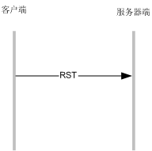

socket编程过程中往往会遇到这样那样的问题，出现了这些问题，有的是由于并发访问量太大造成的，有些却是由于代码中编程不慎造成的。
比如说，最常见的错误就是程序中报打开的文件数过多这个错误。socket建立连接的时候是三次握手，这个大家都很清楚，
但是socket关闭连接的时候，需要进行四次挥手，但很多人对于这四次挥手的具体流程不清楚，吃了很多亏。
## CLOSE_WAIT分析 ##
socket是一种全双工的通信方式，建立完socket连接后，连接的任何一方都可以发起关闭操作。这里不妨假设连接的关闭是客户端发起。客户端的代码如下：

```c
ret = CS_GetConnect(&client,ipAddr,9010);
if (ret == 0) {
	printf("connected success.");
}
CloseSocket(client);
```
代码片段1.1

基本逻辑就是，连接建立后立即关闭。其中CloseSocket函数是自定义函数，仅仅封装了在windows和linux下关闭socket的不同实现而已

	#if defined(WIN32) || defined(WIN64)
	#define CloseSocket(fd) do{ closesocket(fd);/* shutdown(fd, 2);*/ }while(0)
	#else
	#define CloseSocket(fd) do{ close(fd); /*shutdown(fd,2);*/ }while(0)
	#endif
代码片段1.2


图1.1 CLOSE_WAIT出现流程

客户端调用了CloseSocket之后，发送FIN信号到服务器端，告诉socket程序，连接已经断开。服务器端接收到FIN信号后，会将自身的TCP状态置为`CLOSE_WAIT`,同时回复 一个ACK信号给客户端，客户端接收到这个ACK信号后，自身将处于`FIN_WAIT_2`状态。

但是tcp是全双工的通信协议，虽然客户端关闭了连接，但是服务器端对于这个关闭动作不予理睬怎么办。对于服务器端来说，这是个不幸的消息，因为它将一直处于`CLOSE_WAIT`状态，虽然客户端已经不需要和服务器间进行通信了，但是服务器端的socket连接句柄一直得不到释放；如果老是有这种情况出现，久而久之服务器端的连接句柄就会被耗尽。对于发起关闭的客户端来说，他处于`FIN_WAIT_2`状态，如果出现服务器端一直处于`CLOSE_WATI`状态的情况，客户端并不会一直处在`FIN_WAIT_2`状态，因为这个状态有一个超时时间，这个值可以在/etc/sysctl.conf中进行配置。在这个文件中配置`net.ipv4.tcp_fin_timeout=30`即可保证`FIN_WAIT_2`状态最多保持30秒，超过这个时间后就进入TIME_WAIT状态（下面要讲到这个状态）。

**注意：这里socket的关闭从客户端发起，仅仅是为了举例说明，socket的关闭完全也可以从服务器端发起。比如说你写了一个爬虫程序去下载互联网上的某些web服务器上的资源的时候，某些要下载的web资源不存在，web服务器会立即关闭当前的socket连接，但是你的爬虫程序不够健壮，对于这种情况没有做处理，同样会使你的爬虫客户端处于CLOSE_WAIT状态。**

那么怎样预防SOCKET处于CLOSE_WATI状态呢，答案在这里：

```c
	while(true) {
		memset(getBuffer,0,MY_SOCKET_BUFFER_SIZE);
		Ret = recv(client, getBuffer, MY_SOCKET_BUFFER_SIZE, 0);
		if ( Ret == 0 || Ret == SOCKET_ERROR ) 
		{
			printf("对方socket已经退出,Ret【%d】!\n",Ret);
			Ret = SOCKET_READE_ERROR;//接收服务器端信息失败
			break;
		}
	}

clear:
	if (getBuffer != NULL) {
		free(getBuffer);
		getBuffer = NULL;
	}
	closesocket(client);
```
代码片段1.3

这里摘录了服务器端部分代码，注意这个recv函数，这个函数在连接建立时，会堵塞住当前代码，等有数据接收成功后才返回，返回值为接收到的字节数；但是对于连接对方socket关闭情况，它能立即感应到，并且返回0.所以对于返回0的时候，可以跳出循环，结束当前socket处理，进行一些垃圾回收工作，注意最后一句closesocket操作是很重要的，假设没有写这句话，服务器端会一直处于CLOSE_WAIT状态。如果写了这句话，那么socket的流程就会是这样的：


图1.2 `TIME_WAIT`出现流程

## TIME_WAIT分析 ##
服务器端调用了CloseSocket操作后，会发送一个FIN信号给客户端，客户端进入`TIME_WAIT`状态，而且将维持在这个状态一段时间，这个时间也被成为2MSL(MSL是maximum segment lifetime的缩写，意指最大分节生命周期，这是IP数据包能在互联网上生存的最长时间，超过这个时间将在互联网上消失)，在这个时间段内如果客户端的发出的数据还没有被服务器端确认接收的话，可以趁这个时间等待服务端的确认消息。注意，客户端最后发出的ACK N+1消息，是一进入`TIME_WAIT`状态后就发出的，并不是在`TIME_WAIT`状态结束后发出的。如果在发送ACK N+1的时候，由于某种原因服务器端没有收到，那么服务器端会重新发送FIN N消息，这个时候如果客户端还处于`TIME_WAIT`状态的，会重新发送ACK N+1消息，否则客户端会直接发送一个RST消息，告诉服务器端socket连接已经不存在了。

有时，我们在使用netstat命令查看web服务器端的tcp状态的时候，会发现有成千上万的连接句柄处在`TIME_WAIT`状态。web服务器的socket连接一般都是服务器端主动关闭的，当web服务器的并发访问量过大的时候，由于web服务器大多情况下是短连接，socket句柄的生命周期比较短，于是乎就出现了大量的句柄堵在`TIME_WAIT`状态，等待系统回收的情况。如果这种情况太过频繁，又由于操作系统本身的连接数就有限，势必会影响正常的socket连接的建立。在linux下对于这种情况倒是有解救措施，方法就是修改/etc/sysctl.conf文件，保证里面含有以下三行配置：

	#表示开启重用。允许将TIME-WAIT sockets重新用于新的TCP连接，默认为0，表示关闭  
	net.ipv4.tcp_tw_reuse = 1  
	#表示开启TCP连接中TIME-WAIT sockets的快速回收，默认为0，表示关闭  
	net.ipv4.tcp_tw_recycle = 1  
	#表示系统同时保持TIME_WAIT的最大数量，如果超过这个数字，
	#TIME_WAIT将立刻被清除并打印警告信息。默认为180000，改为5000。
	net.ipv4.tcp_max_tw_buckets = 5000
配置型 2.1

关于重用`TIME_WAIT`状态的句柄的操作，也可以在代码中设置：

```c
int on = 1;
if (setsockopt(socketfd/*socket句柄*/,SOL_SOCKET,SO_REUSEADDR,(char *)&on,sizeof(on)))
{
	return ERROR_SET_REUSE_ADDR;
}
```
代码片段2.1

如果在代码中设置了关于重用的操作，程序中将使用代码中设置的选项决定重用或者不重用，/etc/sysctl.conf中`net.ipv4.tcp_tw_reuse`中的设置将不再其作用。

当然这样设置是有悖TCP的设计标准的，因为处于`TIME_WAIT`状态的TCP连接，是有其存在的积极作用的，前面已经介绍过。假设客户端的ACK N+1信号发送失败，服务器端在1MSL时间过后会重发FIN N信号，而此时客户端重用了之前关闭的连接句柄建立了新的连接，但是此时就会收到一个FIN信号，导致自己被莫名其妙关闭。

一般`TIME_WAIT`会维持在2MSL（linux下1MSL默认为30秒）时间，但是这个时间可以通过代码修改：

	struct linger so_linger;
	so_linger.l_onoff = 1;
	so_linger.l_linger = 10;
	if (setsockopt(socketfd,SOL_SOCKET,SO_LINGER,(char *)&so_linger,sizeof(struct linger)))
	{
		return ERROR_SET_LINGER;
	}
代码片段2.2

这里代码将`TIME_WAIT`的时间设置为10秒（在BSD系统中，将会是0.01*10s）。TCP中的`TIME_WAIT`机制使得socket程序可以“优雅”的关闭，如果你想你的程序更优雅，最好不要设置`TIME_WAIT`的停留时间，让老的tcp数据包在合理的时间内自生自灭。当然对于`SO_LINGER`参数，它不仅仅能够自定义`TIME_WAIT`状态的时间，还能够将TCP的四次挥手直接禁用掉，假设对于so_linger结构体变量的设置是这个样子的：

```c
so_linger.l_onoff = 1;
so_linger.l_linger = 0;
```

如果客户端的socket是这么设置的那么socket的关闭流程就直接是这个样子了：


图2.1 RST关闭流程

这相当于客户端直接告诉服务器端，我这边异常终止了，对于我稍后给出的所有数据包你都可以丢弃掉。服务器端如果接受到这种RST消息，会直接把对应的socket句柄回收掉。有一些socket程序不想让TCP出现`TIME_WAIT`状态，会选择直接使用RST方式关闭socket，以保证socket句柄在最短的时间内得到回收，当然前提是接受有可能被丢弃老的数据包这种情况的出现。如果socket通信的前后数据包的关联性不是很强的话，换句话说每次通信都是一个单独的事务，那么可以考虑直接发送RST信号来快速关闭连接。

## 补充 ##
1.文中提到的修改/etc/sysctl.conf文件的情况，修改完成之后需要运行`/sbin/sysctl -p`后才能生效。
2.图1中发送完FIN M信号后，被动关闭端的socket程序中输入流会接收到一个EOF标示，是在C代码中处理时recv函数返回0代表对方关闭，在java代码中会在InputStream的read函数中接收到-1：

```java
Socket client = new Socket();//,9090
	try {
		client.connect(
			new InetSocketAddress("192.168.56.101",9090));
		
		while(true){				
			int c = client.getInputStream().read();
			if (c > 0) {
				System.out.print((char) c);
			} else {//如果对方socket关闭，read函数返回-1
				break;
			}

			try {
				Thread.currentThread().sleep(2000);					
			} catch (InterruptedException e) {
				e.printStackTrace();
			}
		}
	} catch (IOException e2) {
		e2.printStackTrace();
	} finally {
		try {
			client.close();
		} catch (IOException e) {
			e.printStackTrace();
		}
	}

}
```
代码片段3.1

3.如果主动关闭方已经发起了关闭的FIN信号，被动关闭方不予理睬，依然往主动关闭方发送数据，那么主动关闭方会直接返回RST新号，连接双方的句柄就被双方的操作系统回收，如果此时双方的路由节点之前还存在未到达的数据，将会被丢弃掉。

4.通信的过程中，socket双发中有一方的进程意外退出，则这一方将向其对应的另一方发送RST消息，所有双发建立的连接将会被回收，未接收完的消息就会被丢弃。