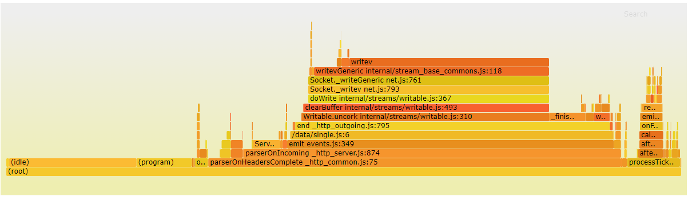
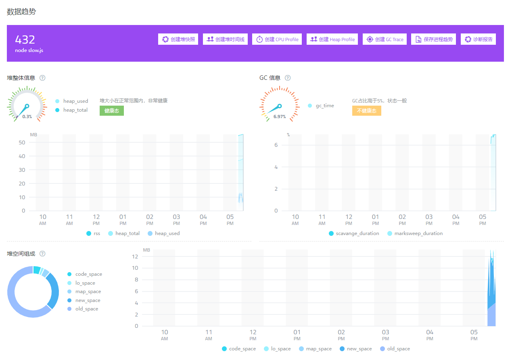
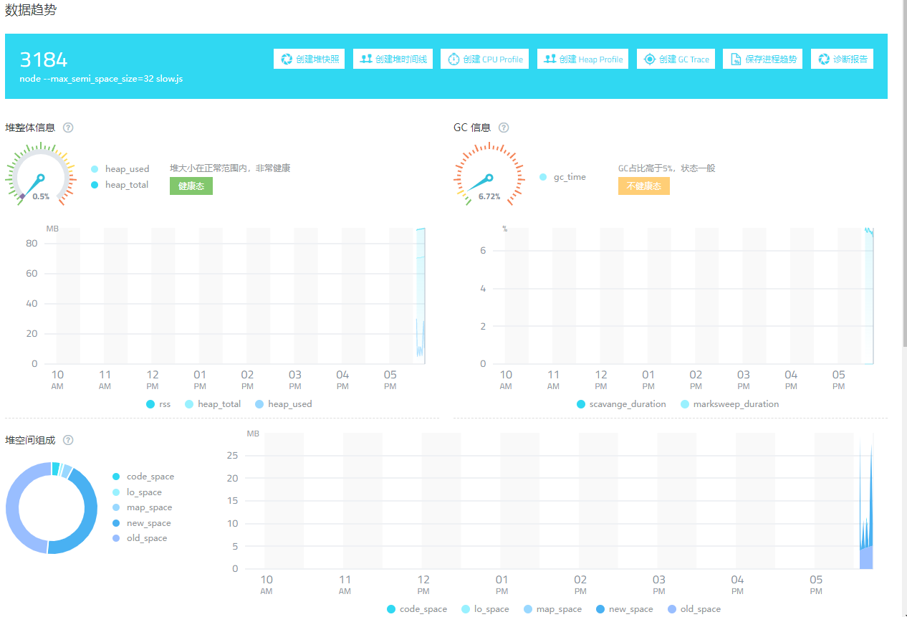
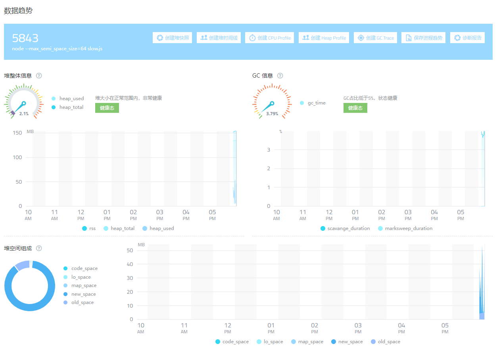

提起 Node.js ，大家可能认为对其的优劣已经分辨的很清楚：由于其默认单线程，所以不适合做计算密集型操作；由于其异步 IO 特性，所以对于 IO 处理比较友好。但这其实是一种误解，当 IO 并发到一定的量级，一样会损耗 CPU 资源。在 Node.js 引以为豪的 IO 处理方面，依然有其做的不完善的地方，本篇文章就给大家一一解密。 

## 1. 问题

### 1.1 负载均衡问题

Node.js 在起步之初，语言层面只能利用单进程，后来官方引入了 [Cluster](https://nodejs.org/dist/latest-v16.x/docs/api/cluster.html) 模块来解决这个问题。但是在操作系统中一个端口号默认只能被一个句柄监听，也就是说不经过特殊设置，服务监听端口只能调用 listen 函数一次。但是我们现在使用了 Cluster 之后，要求每个工作进程都可以接受客户端的请求，该如何实现呢？

（在 Linux 下）Node 底层会采取两种策略，一种是在主进程监听端口完成之后，顺便完成 socket 的 accept 操作，然后将接收的 socket 句柄通过进程间通信平均分发到工作进程中去；一种是主进程绑定端口完成之后，直接把这个句柄发送给工作进程，每个工作进程都自己做监听 和 accept 操作。前者的负载均衡由用户端代码控制，后者的负载均衡由操作系统控制，但是后者的负载均衡的分配会出现不均匀的情况，并且会因为惊群效应，导致性能低下，所以 Node 默认使用的是第一种策略。

> 这里不考虑  Windows 下的场景。

对于第一种策略，主进程会先将接收到的 socket 放入本地数组中，然后再依次从数组头部中截取元素，发送到某一个工作进程中。初步看上去这个流程没有问题，特别是你的请求 QPS 不是很大的时候。但是一旦并发请求量过大，就会出现 socket 句柄在前面提到的本地数组中堆积的现象，数组长度太大的话对于数组的截取操作就变成了一个慢操作，引起主进程 CPU 升高，主进程 CPU 升高会进一步削弱其给工作进程分发 socket 句柄的能力，从而导致本地数组进一步增大，如此恶行循环，最终会导致主进程的老生代内存被撑爆，触发 OOM，主进程被迫退出。

> 默认策略性能低下问题，笔者已经给官方提交了 issue [#37343](https://github.com/nodejs/node/issues/37343) 。

> 如果你的主进程使用 PM2，并且因为 OOM 而退出，会在 ~/.pm2/pm2.log 找到类似日志：
>
> ```
> <--- Last few GCs --->
> 
> [65994:0x3c57eb0] 20952120 ms: Scavenge 874.5 (894.1) -> 858.5 (894.1) MB, 0.9 / 0.0 ms  (average mu = 0.995, current mu = 0.993) allocation failure 
> [65994:0x3c57eb0] 20952493 ms: Scavenge 874.5 (894.1) -> 858.5 (894.1) MB, 1.4 / 0.0 ms  (average mu = 0.995, current mu = 0.993) allocation failure 
> [65994:0x3c57eb0] 20952859 ms: Scavenge 874.5 (894.1) -> 858.5 (894.1) MB, 0.9 / 0.0 ms  (average mu = 0.995, current mu = 0.993) allocation failure 
> 
> 
> <--- JS stacktrace --->
> 
> ==== JS stack trace =========================================
> 
>     0: ExitFrame [pc: 0x1381859]
> Security context: 0x0a5f87230cc9 <JSObject>
>     1: /* anonymous */ [0x354d92c72169] [internal/cluster/round_robin_handle.js:~32] [pc=0x1be20be0065](this=0x3cd6cfa14001 <TCP map = 0x2e9326ca19f1>,-24,0x10a4561c04a9 <undefined>)
>     2: InternalFrame [pc: 0x12ff49d]
>     3: EntryFrame [pc: 0x12ff278]
> 
> ==== Details ================================================
> 
> [0]: ExitFrame [pc: 0x1381859]
> [1]: /* anonymou...
> 
> FATAL ERROR: invalid array length Allocation failed - JavaScript heap out of memory
> 
> Failed to open Node.js report file: report.20210123.192612.65994.0.001.json (errno: 24)
>  1: 0x9dbd20 node::Abort() [PM2 v4.1.2: God Daemon (/root/.pm2)]
>  2: 0x9dced6 node::OnFatalError(char const*, char const*) [PM2 v4.1.2: God Daemon (/root/.pm2)]
>  3: 0xb3d96e v8::Utils::ReportOOMFailure(v8::internal::Isolate*, char const*, bool) [PM2 v4.1.2: God Daemon (/root/.pm2)]
>  4: 0xb3dce9 v8::internal::V8::FatalProcessOutOfMemory(v8::internal::Isolate*, char const*, bool) [PM2 v4.1.2: God Daemon (/root/.pm2)]
>  5: 0xcea835  [PM2 v4.1.2: God Daemon (/root/.pm2)]
>  6: 0xcc1340 v8::internal::Factory::NewUninitializedFixedArray(int, v8::internal::AllocationType) [PM2 v4.1.2: God Daemon (/root/.pm2)]
>  7: 0xe2c261  [PM2 v4.1.2: God Daemon (/root/.pm2)]
>  8: 0xe2c510  [PM2 v4.1.2: God Daemon (/root/.pm2)]
>  9: 0xfd41db v8::internal::Runtime_GrowArrayElements(int, unsigned long*, v8::internal::Isolate*) [PM2 v4.1.2: God Daemon (/root/.pm2)]
> 10: 0x1381859  [PM2 v4.1.2: God Daemon (/root/.pm2)]
> ```
>
> internal/cluster/round_robin_handle.js 正是 Node 中处理主进程给工作进程分发 socket 句柄的逻辑的代码。

解决当前问题的思路，无怪乎有三种：提高当前策略的效率，换一个更高效稳定的策略，降低客户端连接建立频率。对于第一种解决方案，在 pull request [#40615](https://github.com/nodejs/node/pull/40615) 中得到改善；对于第二种方案，可以使用 Linux 内核 3.9+ 中新出来的 `SO_REUSEPORT` 特性来解决，官方在 [22.12.0](https://nodejs.org/api/net.html#serverlisten) 版本提供了支持，对于老版本 Node 来说可以采用下面的方案三。

有高并发的服务一般都是大量用户同时访问导致的，对于这种从用户端来的流量，我们按照管理都会在前面架设 nginx，来做 https 证书解析和反向代理。我们就可以在这个 nginx 上做文章。

比如说我们有如下 nginx 配置：

```nginx
upstream service1 {
    server 192.168.1.3:8000;
    server 192.168.1.5:8000;
}

server {
    listen       8080;
	location =/ {
        add_header Content-Type text/html;
		add_header Cache-Control no-cache,max-age=0;
		return 200 "This is home";
    }
    location / {
        proxy_pass  http://service1;
        proxy_redirect off;
        proxy_set_header X-Forwarded-Proto $scheme;
        proxy_set_header X-Real-IP $remote_addr;
        proxy_set_header X-Forwarded-For $proxy_add_x_forwarded_for;
        proxy_set_header Host $http_host;
        proxy_connect_timeout   120;
        proxy_send_timeout      120;
        proxy_read_timeout      120;
    }    
}
```

**代码 1.1.1**

上述代码看上去没有什么问题，一般网上的资料在配置反向代理的时候，也都跟上述代码差不多。但是如果使用上述配置那么 nginx 和 node 服务之间使用的就是 HTTP 1.0 版本的协议，也就是说对于每次请求来说底层都会创建一个 socket 句柄。随着并发量的增多，积压在主进程中的待发送句柄就会增多，正好暴露出来了我们之前提到的主进程默认负载策略效率低下的问题。

解决方案也挺简单，就是改用 HTTP 1.1

```nginx
upstream service1 {
    server 192.168.1.3:8000 max_conns=128;
    server 192.168.1.5:8000 max_conns=128;
	
    keepalive_timeout 1800s;
    keepalive_requests 10000000;
    least_conn;
    keepalive 256;
}

server {
    listen       8080;
	location =/ {
        add_header Content-Type text/html;
		add_header Cache-Control no-cache,max-age=0;
		return 200 "This is home";
    }
    location / {
        proxy_pass  http://service1;
        proxy_redirect off;
        proxy_http_version              1.1;
        proxy_set_header                Connection "";
        proxy_set_header X-Forwarded-Proto $scheme;
        proxy_set_header X-Real-IP $remote_addr;
        proxy_set_header X-Forwarded-For $proxy_add_x_forwarded_for;
        proxy_set_header Host $http_host;
        
        proxy_connect_timeout   120;
        proxy_send_timeout      120;
        proxy_read_timeout      120;
    }    
}
```

**代码 1.1.2**

在 location 代码块中需要加入 `proxy_http_version 1.1;` `proxy_set_header Connection "";` 这两行，同时留意到我们在 upstream 代码块中加入了 `max_conns` `keepalive_timeout` `keepalive_requests` `least_conn` `keepalive` 这几个新的指令（或者属性）。首先是 `keepalive` 这个指令，它的使用经常会让大家产生误解，以为这个是 nginx 和 upstream 服务的最大连接数，其实不然。`keepalive` 限制的是每个 nginx 工作进程和 upstream 服务列表中的服务的最大空闲连接数，超过这个连接数的连接，会被 nginx 工作进程回收掉。而 `server` 指令中的 `max_conns` 属性才是当前 `server` 指令所指向的服务器和各个 nginx 工作进程之间的最大连接数。考虑这么一种情况，如果当前请求的并发量相当之大，QPS 为 1000/s，那么在短时间内发送到 nginx 的句柄就有 1000 个之多。简单考虑，我们的 nginx 只启动了一个工作进程，如果不设置 `max_conns` 的话，那么 upstream 中的两个 server 每个都要承载 500 的并发，假设当前没有空闲句柄的话，每个 server 端都会和 nginx 建立 500 个 socket 句柄。而如果设置了 `max_conns` 时，nginx 工作进程就会自己维护一个句柄池，借用之前创建的句柄来发送新的请求。

> nginx 和 node 比较类似的地方是，他也分工作进程和主进程。

`keepalive_timeout` 和 `keepalive_requests` 这两个指令，大家在查阅资料的时候，一定要擦亮眼睛，因为两个指令可以同时存在 upstream 代码块中和 http 代码块中，大家一定要看 [upstream](http://nginx.org/en/docs/http/ngx_http_upstream_module.html) 模块的文档。这两个指令用来规定空闲句柄的回收策略，如果一个空闲句柄超过了 `keepalive_timeout` 时间了，或者一个句柄发送过 `keepalive_requests` 次请求了，那么就会被 nginx 强制回收。

最后讲到的是 `least_conn` 指令，它告诉 nginx 工作进程，在进行负载均衡的时候，挑选那个何其建立句柄数最少的服务器进行发送。由于我们要控制 upstream 服务的句柄数，所以这里选择了使用 `least_conn` 这个策略，nginx 的默认策略是轮询策略。

> 需要指出的是，如果你的 `server` 指令配置的是域名，并且这个域名会被随机解析出不同 IP 的话，使用免费版本的 nginx 不能很好的解决这个问题。虽然 upstream 代码块中可以设置 `resolve`  指令来动态解析域名，不过你需要付费购买收费版本才能使用这个指令。

改完 nginx 端配置后，同样也需要修改 Node 端的代码：

```javascript
const http = require('http');
const process = require('process');


const TIMEOUT_SERVER = 1000 * 60 * 30;
const server = http.createServer((req, res) => {
	res.writeHead(200);
	res.end('hello world\n');
}).listen(8000);
server.timeout = TIMEOUT_SERVER;
server.keepAliveTimeout = TIMEOUT_SERVER;

console.log(`${process.pid} started`);
```

**代码 1.1.3**

我们只关注最后两句即可，Node 端同样需要设置空闲时间，否则服务端默认 5s 内没有从当前 socket 句柄中接收到请求，就自己强制断开当前句柄。

做完上述改动后，我们单条连接的生命周期被拉长，不会出现单位时间内创建过多 socket 句柄的现象。但是我们依然要考虑到，当前的 socket 句柄依然是有生命周期的，特别是在服务器端（这里指 Node 端）检测到空闲超时后，一样会断开连接，但是这时候恰巧有客户端（这里指 Nginx 端）的请求正在发送的路上，服务器端接收到这个迟来的请求后，会直接拒绝。这是一个边界的小概率问题，但是不代表不会发生。出现这种情况，如果是 GET 请求还好说，让用户端程序直接重试即；如果是 POST 请求，就要和用户端程序协商好，如何做到幂等性。

### 1.2 IO 读写

提到 IO 操作，大家一般认为它不会耗费多少 CPU 时间，如果按照这个逻辑的话，一个返回 hello world 的 HTTP 请求在并发请求数逐渐增大的情况下， CPU 应该没有压力才对。

我们尝试对于 **代码1.1.3** 进行打压，然后一探究竟。

打压工具选择常用的 JMeter，下面给出打压用的配置文件：

```xml
<?xml version="1.0" encoding="UTF-8"?>
<jmeterTestPlan version="1.2" properties="5.0" jmeter="5.3">
  <hashTree>
    <TestPlan guiclass="TestPlanGui" testclass="TestPlan" testname="Test Plan" enabled="true">
      <stringProp name="TestPlan.comments"></stringProp>
      <boolProp name="TestPlan.functional_mode">false</boolProp>
      <boolProp name="TestPlan.tearDown_on_shutdown">true</boolProp>
      <boolProp name="TestPlan.serialize_threadgroups">false</boolProp>
      <elementProp name="TestPlan.user_defined_variables" elementType="Arguments" guiclass="ArgumentsPanel" testclass="Arguments" testname="User Defined Variables" enabled="true">
        <collectionProp name="Arguments.arguments"/>
      </elementProp>
      <stringProp name="TestPlan.user_define_classpath"></stringProp>
    </TestPlan>
    <hashTree>
      <ThreadGroup guiclass="ThreadGroupGui" testclass="ThreadGroup" testname="Thread Group" enabled="true">
        <stringProp name="ThreadGroup.on_sample_error">continue</stringProp>
        <elementProp name="ThreadGroup.main_controller" elementType="LoopController" guiclass="LoopControlPanel" testclass="LoopController" testname="Loop Controller" enabled="true">
          <boolProp name="LoopController.continue_forever">false</boolProp>
          <intProp name="LoopController.loops">-1</intProp>
        </elementProp>
        <stringProp name="ThreadGroup.num_threads">16</stringProp>
        <stringProp name="ThreadGroup.ramp_time">1</stringProp>
        <boolProp name="ThreadGroup.scheduler">false</boolProp>
        <stringProp name="ThreadGroup.duration"></stringProp>
        <stringProp name="ThreadGroup.delay"></stringProp>
        <boolProp name="ThreadGroup.same_user_on_next_iteration">true</boolProp>
      </ThreadGroup>
      <hashTree>
        <HTTPSamplerProxy guiclass="HttpTestSampleGui" testclass="HTTPSamplerProxy" testname="HTTP Request" enabled="true">
          <elementProp name="HTTPsampler.Arguments" elementType="Arguments" guiclass="HTTPArgumentsPanel" testclass="Arguments" testname="User Defined Variables" enabled="true">
            <collectionProp name="Arguments.arguments"/>
          </elementProp>
          <stringProp name="HTTPSampler.domain">the_ip_of_your_service</stringProp>
          <stringProp name="HTTPSampler.port">8000</stringProp>
          <stringProp name="HTTPSampler.protocol"></stringProp>
          <stringProp name="HTTPSampler.contentEncoding"></stringProp>
          <stringProp name="HTTPSampler.path">/</stringProp>
          <stringProp name="HTTPSampler.method">GET</stringProp>
          <boolProp name="HTTPSampler.follow_redirects">true</boolProp>
          <boolProp name="HTTPSampler.auto_redirects">false</boolProp>
          <boolProp name="HTTPSampler.use_keepalive">true</boolProp>
          <boolProp name="HTTPSampler.DO_MULTIPART_POST">false</boolProp>
          <stringProp name="HTTPSampler.embedded_url_re"></stringProp>
          <stringProp name="HTTPSampler.connect_timeout"></stringProp>
          <stringProp name="HTTPSampler.response_timeout"></stringProp>
        </HTTPSamplerProxy>
        <hashTree>
          <ResultCollector guiclass="ViewResultsFullVisualizer" testclass="ResultCollector" testname="View Results Tree" enabled="false">
            <boolProp name="ResultCollector.error_logging">false</boolProp>
            <objProp>
              <name>saveConfig</name>
              <value class="SampleSaveConfiguration">
                <time>true</time>
                <latency>true</latency>
                <timestamp>true</timestamp>
                <success>true</success>
                <label>true</label>
                <code>true</code>
                <message>true</message>
                <threadName>true</threadName>
                <dataType>true</dataType>
                <encoding>false</encoding>
                <assertions>true</assertions>
                <subresults>true</subresults>
                <responseData>false</responseData>
                <samplerData>false</samplerData>
                <xml>false</xml>
                <fieldNames>true</fieldNames>
                <responseHeaders>false</responseHeaders>
                <requestHeaders>false</requestHeaders>
                <responseDataOnError>false</responseDataOnError>
                <saveAssertionResultsFailureMessage>true</saveAssertionResultsFailureMessage>
                <assertionsResultsToSave>0</assertionsResultsToSave>
                <bytes>true</bytes>
                <sentBytes>true</sentBytes>
                <url>true</url>
                <threadCounts>true</threadCounts>
                <idleTime>true</idleTime>
                <connectTime>true</connectTime>
              </value>
            </objProp>
            <stringProp name="filename"></stringProp>
          </ResultCollector>
          <hashTree/>
          <ResultCollector guiclass="SummaryReport" testclass="ResultCollector" testname="Summary Report" enabled="true">
            <boolProp name="ResultCollector.error_logging">false</boolProp>
            <objProp>
              <name>saveConfig</name>
              <value class="SampleSaveConfiguration">
                <time>true</time>
                <latency>true</latency>
                <timestamp>true</timestamp>
                <success>true</success>
                <label>true</label>
                <code>true</code>
                <message>true</message>
                <threadName>true</threadName>
                <dataType>true</dataType>
                <encoding>false</encoding>
                <assertions>true</assertions>
                <subresults>true</subresults>
                <responseData>false</responseData>
                <samplerData>false</samplerData>
                <xml>false</xml>
                <fieldNames>true</fieldNames>
                <responseHeaders>false</responseHeaders>
                <requestHeaders>false</requestHeaders>
                <responseDataOnError>false</responseDataOnError>
                <saveAssertionResultsFailureMessage>true</saveAssertionResultsFailureMessage>
                <assertionsResultsToSave>0</assertionsResultsToSave>
                <bytes>true</bytes>
                <sentBytes>true</sentBytes>
                <url>true</url>
                <threadCounts>true</threadCounts>
                <idleTime>true</idleTime>
                <connectTime>true</connectTime>
              </value>
            </objProp>
            <stringProp name="filename"></stringProp>
          </ResultCollector>
          <hashTree/>
        </hashTree>
      </hashTree>
    </hashTree>
  </hashTree>
</jmeterTestPlan>
```

**代码 1.2.1 single.jmx**

第 41 行中 `HTTPSampler.use_keepalive` 属性设置为 true，这样就能使用 http 1.1 的 keepalive 属性，我们将其设置为 `true`，这也是 JMeter 的默认值。如果改为 false，就会频繁创建 socket 句柄的问题，有可能把机器的句柄数跑满。

> 在压测开始后，通过运行命令 ` netstat -antp | grep 8000 | grep ESTABLISHED | wc -l` 会发现输出 `16`，这是由于我们启用了 keepalive，且压测端开启了 16 个线程。线程数是在 21 行 `ThreadGroup.num_threads` 属性设置的。

第 33 行中的 `HTTPSampler.domain` 属性要设置为 **代码 1.1.3** 启动的服务的 IP 地址。

我们使用命令 

```shell
bin/jmeter.sh -n -t the_path_of_single.jmx -l /tmp/single.jtl -e -o /tmp/single.out
```

**命令 1.2.1**

即可发起对于服务端的压测，正常情况下 JMeter 应该会有如下输出：

```
Creating summariser <summary>
Created the tree successfully using ../single.jmx
Starting standalone test @ Tue Nov 30 14:16:19 CST 2021 (1638252979737)
Waiting for possible Shutdown/StopTestNow/HeapDump/ThreadDump message on port 4445
Warning: Nashorn engine is planned to be removed from a future JDK release
summary + 118675 in 00:00:10 = 11953.6/s Avg:     1 Min:     0 Max:    50 Err:     0 (0.00%) Active: 16 Started: 16 Finished: 0
summary + 382998 in 00:00:30 = 12766.6/s Avg:     1 Min:     0 Max:    18 Err:     0 (0.00%) Active: 16 Started: 16 Finished: 0
```

这就代表压测成功了。

然后我们发现，服务端的 CPU 已经 100%了，那么到底是什么原因导致其 CPU 跑满呢？通过 CPU 火焰图可以发现 socket 写入比较耗时。

**图 1.2.1**

其实一个完整的 HTTP 请求的处理，还包括 socket 原始数据包，读取后还解析其中的内容。前者是在 libuv 中的poll 阶段完成，后者在 Node 中是使用原生库 [llhttp](https://github.com/nodejs/llhttp) 实现的，这两者都是运行在原生代码中，所以要算到 `(program)` 中。但是服务器端处理完数据后，调用 `end` 函数触发 socket 写入的时候，是在 Node 端显式调用的，所以我们在火焰图中可以清晰的看到。

> 从上面的分析可以推断出，socket 的读是要比写要轻量的。这是由于对于读操作从内核态中读取出来的数据，是已经做完协议栈解析后的数据；而写操作，并不是仅仅将原数据写到内核态的缓冲区就完事了，而是还要走一遍协议栈封包，组装完成后，如果当前允许发送则直接发送，否则写入内部队列。具体参见 [网络通信之收包](https://ty-chen.github.io/linux-kernel-tcp-receive/) 和 [网络通信之发包](https://ty-chen.github.io/linux-kernel-tcp-send/) 。
>
> socket 的读是要比写要轻量是建立在同级别数据包大小的情况下，如果服务端处理上传的大文件，必然会耗费大量的 CPU 时间用在读上。

socket 读写需要做系统调用，需要损耗 CPU ，不管你使用任何编程语言，都无可避免，但是碍于 Node 的单线程机制，IO 操作和用户的 js 代码逻辑在一个线程中，必然会相互挤占资源。所以对于程序中的一些不必要的 IO 处理，比如说打日志（包括控制台日志）、上报打点之类的操作，尽量做到定时批量操作，让出更多的 CPU 时间给逻辑代码。

> 关于异步日志打印的库，可以参见笔者的 [node-slogger](https://www.npmjs.com/package/node-slogger) 包。

### 1.3 保守的 GC 参数

编程语言的内存一般分为 栈（Stack）和 堆（Heap）两部分，JavaScript 的内存也是这种布局。其中 栈 用来存储函数的执行的上下文和字面量类型的值（数字、字符串、布尔、指针等类型）。堆 用来存储对象（Array Object Function 等类型）。堆又会被划分为 `新生代（New space）` `老生代（Old space）` `大对象空间（Large object space）` `代码空间（Code space）` ，同时还包括存储隐藏类相关的数据的区域 （下图中的 `Cell space` `Property cell space` `Map space` ）。对于 GC 来说，我们需要关心的仅仅只有 `新生代` 和 `老生代`。


**图 1.3.1**

JavaScript 中新建一个对象，默认进入新生代（除非这个对象超大，新生代和老生代装不下，这种大对象会进入 `大对象空间`）。新生代分为 `Used` 和 `Inactive` 两个区块（上图中的两个 `Semi space` 区块，这两个区块也通常被称之为 `From` 和 `To` 区块），新分配的对象会分配到 `Used` 区块。当 `Used` 区块满时，会强制触发一次新生代的 GC，GC 收集器会扫描 `Used` 区块，找到还在使用的对象拷贝到 `Inactive` 区块，当 `Used` 区块中所有对象扫描完成后，`Used` 就是一块清空的区块了，最后交换 `Used` 和 `Inactive` 两个区块，现在新的 `Used` 块就变成了原来的那个 `Inactive` 块。

虽然 V8 内部使用了线程池来并行做 GC，但是只要有 GC 在工作，主线程就必须 Stop the world，所以说 GC 的时间越长，给我们应用程序带来的延迟时间就越长。刚才上面分析过，新生代分为 `Used` 和 `Inactive` 两部分，`Used` 用满后就触发 GC。但是一个悲观的事实是 Node 中这两个区块的初始值比较小，只有 16MB（两个区块的大小是相同的），如果你的代码逻辑中处理的数据量比较多，可能很快会塞满 `Used` 区域，导致 GC 频繁发生。

下面我们使用一段代码来模拟一下：

```javascript
const http = require('http');
const process = require('process');

class MyObject {
    constructor(i) {
        this.index = i;
    }
}
const ARRAY_LEN = 1024 * 10;
const _bigArrayTemp = function __bigArrayTemp() {
    const arr = new Array(ARRAY_LEN)
    for(var i=0;i<ARRAY_LEN;i++) {
        arr[i] = new MyObject(i);
    }
}
const TIMEOUT_SERVER = 1000 * 60 * 30;
const server = http.createServer((req, res) => {
    _bigArrayTemp();
    res.writeHead(200);
    res.end('hello world\n');
}).listen(8000);
server.timeout = TIMEOUT_SERVER;
server.keepAliveTimeout = TIMEOUT_SERVER;

console.log(`${process.pid} started`);
```

**代码 1.3.1 slow.js**

运行 **代码 1.3.1** `node slow.js`， 使用 JMeter 对其打压，稳定后可以看到 GC 的占比在 6% 左右。



**图 1.3.2**

在运行 node 的时候，添加参数 `--max_semi_space_size=x` 可以手动修改 `Used` 和 `Inactive` 区块的大小，这里的 `x` 值只能是 2 的指数值。

使用命令 `node --max_semi_space_size=32 slow.js` 运行后，重新做压测，观测到差别不大



**图 1.3.3**

改成 64 MB，再观测



**图 1.3.4**

可以看到 GC 时间降到 4% 以下。

将其再次扩大到 128 MB


**图 1.3.5**

GC 时间占比没有发生明显变化，且比 64MB 的 GC 占时还要稍高。

所以综上来看 Node 的 `max_semi_space_size` 参数设置为 64 才更合理些，但是 Node 官方仅仅是把 V8 拿来使用了，并没有对其做修改以适应服务器端环境。设置为 16 MB，在浏览器端是问题不大的，但是服务器端经常要操作大量数据内容，16 MB 就显得捉襟见肘了。

同时要注意的是，也不要一次性操作太多的内存，比如说将 **代码 1.3.1** 中的 `ARRAY_LEN` 常量设置为 `10` 万的时候，即使在怎么设置 `max_semi_space_size` 的值都用处不大，GC 的时间占比都会特别大。所以说不要在 Node 中一次性操作特别多的对象数据，否则 GC 的延迟时间有多大，对于主线程的损害就有多大。

## 2. 参考资料

Trash talk: the Orinoco garbage collector https://v8.dev/blog/trash-talk

How is data stored in V8 JS engine memory? https://blog.dashlane.com/how-is-data-stored-in-v8-js-engine-memory/

🚀 Visualizing memory management in V8 Engine (JavaScript, NodeJS, Deno, WebAssembly) https://deepu.tech/memory-management-in-v8/

Primitive and Reference value in JavaScript https://www.geeksforgeeks.org/primitive-and-reference-value-in-javascript/
